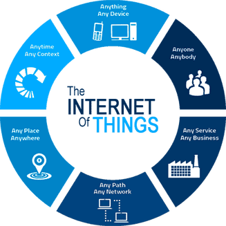

<!-- TODO Smart building, smart houses, monitoring, dashboarding, ... -->

<!-- Consumer applications
Commercial application
Industrial applications
Infrastructure applications
Military applications -->

# <!-- fit --> The Internet of Things

Nico De Witte
bereikbaar via [nico.dewitte@vives.be](mailto:nico.dewitte@vives.be)

---

# The Internet of Things

Het internet der dingen (Internet of Things - IoT) bestaat uit apparaten - van eenvoudige sensoren tot smartphones en wearables - met elkaar verbonden.

* Alles wat met internet is verbonden
* Steeds vaker objecten die met elkaar praten (machine-to-machine, m2m)

---

<!-- Source: https://cyberimpulses.com/internet-of-things/ -->

---

# Sterke Evolutie in Technologie

* realtime gegevens analyse
* machine learning
* sensoren
* draadloze communicatie
* embedded systemen
* ...

---

# Doel

* Data verzamelen
* Combineren tot informatie
* Analyseren van deze informatie
* Maken van beslissingen
* Overgaan tot actie
* Creeeren van meerwaarde

<!-- Source: https://www.brillicaservices.com/understanding-the-internet-of-things-what-it-is-how-it-functions-and-why-it-matters/ -->

---

# IoT

* Het gaat om netwerken
* Het gaat om apparaten
* Het gaat om gegevens

---

# Voorbeeld

* Slimme thermostaten, waarbij de verwarming inschakelt volgens de gebruiksgewoontes van de bewoner.

---

# Voorbeeld

* Detectie en weergave beschikbare parkeerplaatsen in een stadscentrum, parking ...

---

# Voorbeeld

* Meten en registeren van energieverbruik en -productie. Verbruikers in- en uitschakelen, afhankelijk van de lokale energieproductie.

---

# Voorbeeld

* Bewatering in een serre aan de hand van detectie van de grondvochtigheid.

---

# Voorbeeld

* Steps en slimme deelfietsen in steden.

---

# Voorbeeld

* Detectie hoeveelheid vuilnis in een openbare vuilbak, glasbak ...

---

# Voorbeeld

* Gebruikstijd, productie ... van machines en toestellen registeren en analyseren.

---

# Voorbeeld

* Domotica-systemen.

---

# Voorbeeld

* Smart-cities

---

<!-- Source: https://datanews.knack.be/ict/nieuws/het-internet-der-dingen-hoe-futuristische-films-sneller-dan-gedacht-realiteit-werden/article-normal-545751.html?cookie_check=1581619376 -->
