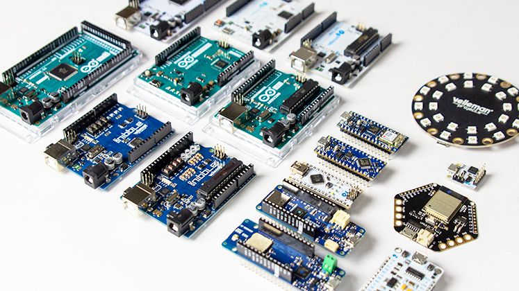
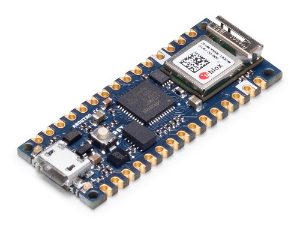
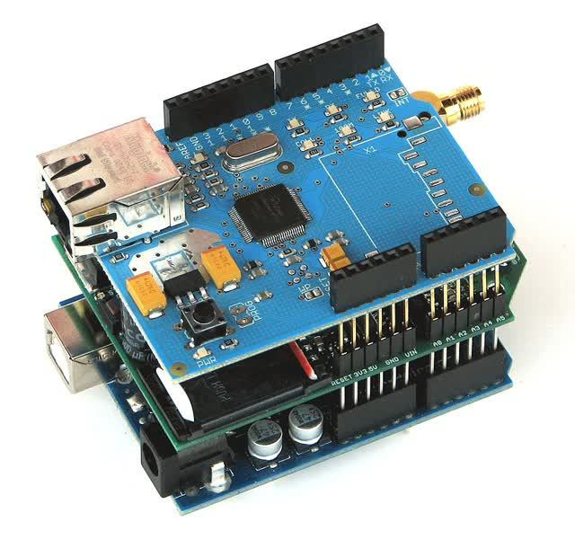
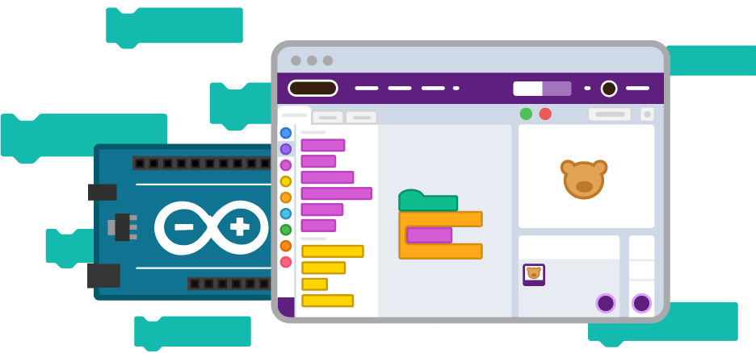
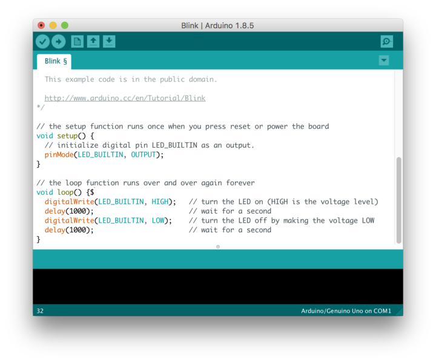
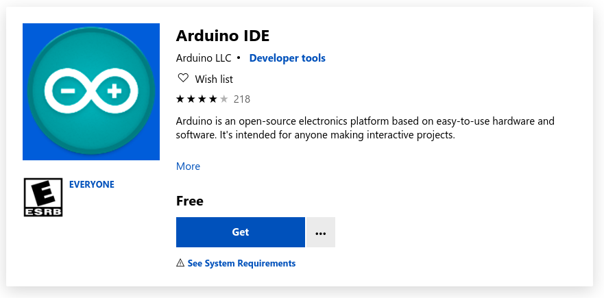

# <!-- fit --> Starten met Arduino

Nico De Witte
bereikbaar via [nico.dewitte@vives.be](mailto:nico.dewitte@vives.be)

---

# Doel

Korte introductie in Arduino en installeren van de IDE.

---

# Arduino

Arduino is een open-source hardware- en softwarebedrijf, project- en gebruikersgemeenschap die microcontrollerborden en shields ontwerpt en produceert voor het bouwen van digitale apparaten.

---

# Licentie

GNU Lesser General Public License (LGPL) of de GNU General Public License (GPL)

* **Iedereen kan Arduino boards en software produceren.**

---

# Arduino Boards

<!-- Source: https://www.vellemanformakers.com/the-ultimate-arduino-guide/ -->

---

# Arduino IoT

Arduino richt de dag van vandaag ook meer en meer de pijlen op het IoT verhaal. Dit is te merken aan hun IoT Cloud platform en hun IoT gerichte ontwikkelingsbordjes zoals de **Arduino Nano 33 IoT**

<!-- Source: https://store.arduino.cc/arduino-nano-33-iot -->

---

# Eigenschappen

* Microcontroller/microprocessor
* Analoge I/O's
* Digitale I/O's
* Serial, USB, I2C, SPI, ...
* Ethernet, WiFi, Bluetooth, LoRaWAN, ...
* ...

<!-- Source: https://en.wikipedia.org/wiki/Arduino -->

---

# Shields

Arduino headers kunnen worden gekoppeld aan verschillende uitbreidingskaarten - shields - of breadboards (voor prototyping) en andere circuits.

<!-- Source: https://computertotaal.nl/artikelen/overige-elektronica/wat-is-arduino-en-waarom-is-het-zo-leuk/ -->

---

# Programmeren

* C++
* Flowcode
* Scratch 4 arduino
* Snap 4 arduino
* Ardublocks
* PictoBlox

<!-- https://thestempedia.com/tutorial-hub/pictoblox-tutorial/arduino-with-pictoblox-tutorial/ -->

---

# Arduino IDE

Naast het gebruik van traditionele compiler-toolchains, biedt het Arduino-project ook een eigen geïntegreerde ontwikkelomgeving (IDE).

<!-- Source: https://commons.wikimedia.org/wiki/File:Arduino_IDE_-_Blink.png -->

---

# Download de IDE

Je kan de IDE downloaden op de website van Arduino of makkelijker via de Windows Store App.

