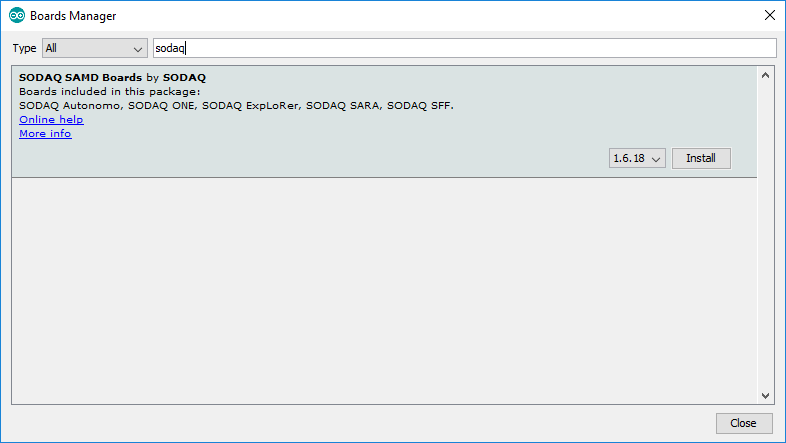
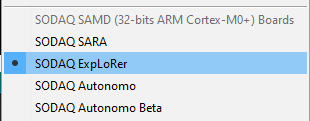
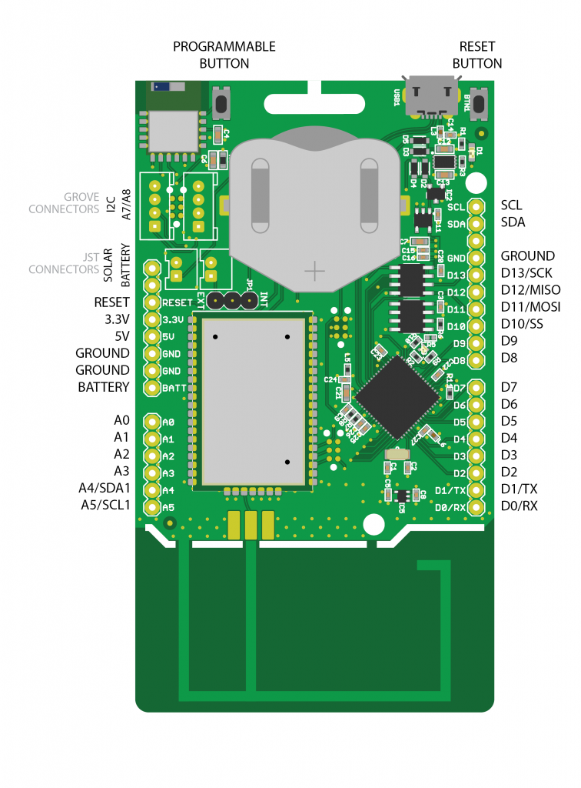
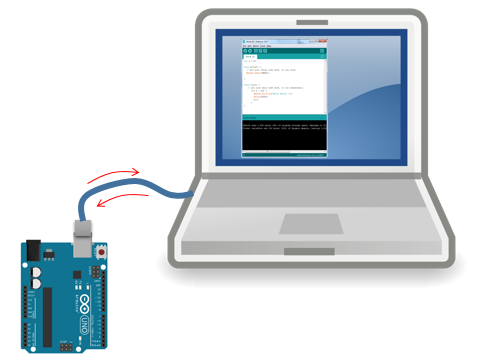
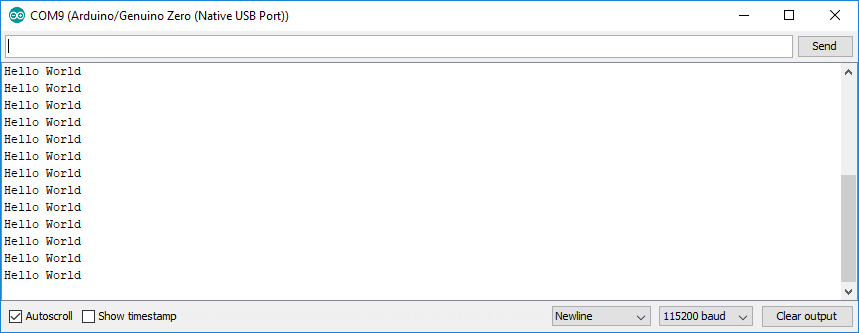
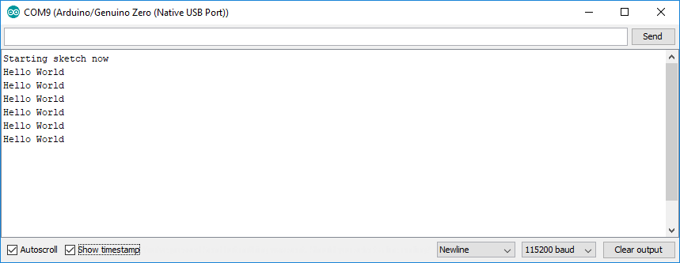

# <!-- fit --> Starten met Arduino

Nico De Witte
bereikbaar via [nico.dewitte@vives.be](mailto:nico.dewitte@vives.be)

---

# Doel

Kennis maken met SODAQ ExpLoRer en opzetten van Blinky - De Hello World van embedded systemen.


---

# SODAQ ExpLoRer

Het SODAQ ExpLoRer ontwikkelbord is een Arduino compatibel bord gemaakt voor onderzoeks- en labo doeleinden.


---

# Een echt IoT board

* **LoRaWAN module** voor draadloze communicatie
* **Bluetooth Low Energy** (BLE)
* voorzien van een **oplaadbare batterij**
  * Kan worden opgeladen via USB, externe voeding of **zonnepaneel**
* **Externe sensoren** via
  * I/O's
  * **Grove systeem**


---

## Paar belangrijke specs

| Eigenschap | Waarde |
| ------ | ----- |
| Microcontroller | ATSAMD21J18, 32-Bit ARM Cortex M0+ @ 48MHz |
| Geheugen | 256KB flash en 32KB SRAM |
| Voeding | 3.3V |
| Maximale DC stroom per I/O | 7 mA |
| LEDs | RGB LED, Blue LED |
| LoRa | Microchip RN2483 module |
| Temperatuursensor | MCP9700AT |

---

## Batterijbeheer

De ExpLoRer werkt op een oplaadbare knoopcel batterij die er standaard wordt bijgeleverd. Om de batterij op te laden, kan de ExpLoRer op USB en/of op een zonnepaneel worden aangesloten.

De ExpLoRer kan echter maar 1 batterij tegelijkertijd gebruiken. Verplaats de schakelaar om te kiezen tussen de interne knoopcel batterij of een externe batterij. Enkel de geselecteerd batterij wordt opgeladen.

---

# Starten met de SODAQ ExpLoRer

* Start de Arduino IDE op

---

# Toevoegen van het SODAQ board

Vooraleer er van start kan worden gegaan moet het ontwikkelbord worden toegevoegd aan de board manager van Arduino. Dit doe je door in de Arduino IDE te navigeren naar `File => Preferences` en in het invulvak `Additional Boards Managers URLs` het volgende in te vullen:

```text
http://downloads.sodaq.net/package_sodaq_samd_index.json
```

Klik op `Ok`.

---

# Definitie van board installeren

Vervolgens dienen we de nieuwste definitie van dit bord te installeren. Ga hiervoor naar `Tools => Board => Boards Manager ...` en type dan `sodaq` in het **filterveld**.

---



---

# Installeren definitie van board

Klik vervolgens op **Install** voor het bord `SODAQ SAMD Boards by SODAQ`.

Neem gerust een koffie, dit duurt wel even.

---

# Selecteren van Board

Zorg er vervolgens voor dat het SODAQ ExpLoRer bord is geselecteerd onder `Tools => Board`.



---

# COM-poort instellen

Als laatste dien je ook aan te duiden op welke COM-poort het bord is aangesloten. Ga naar `Tools => Port` en selecteer de correcte COM-poort.

---

# Blinky 

Blinky is de "Hello World" van embedded system. Een super simpel voorbeeld qua code.

**Doel?** Kijken of IDE en compiler werken, het lukt om het bord te flashen en of het bord de applicatie wil uitvoeren.

---

# Blinky

* Setup code wordt 1x uitgevoerd bij opstarten

```cpp
void setup() {
  // LED = Output
  pinMode(LED_BUILTIN, OUTPUT);
}
```

---

# Blinky

* Loop is een lus die blijft itereren

```cpp
void loop() {
  // Led AAN  
  digitalWrite(LED_BUILTIN, HIGH);
  
  // Even wachten
  delay(500);   // 500ms
  
  // Led UIT
  digitalWrite(LED_BUILTIN, LOW);

  // Even wachten
  delay(500);   // 500ms
}
```

---

# Sketch compileren en uploaden

Klik op het groene pijltje links of klik op `Sketch => Upload`.

Controleer op errors.

De sketch wordt na het opladen of het inpluggen van de voeding direct gestart. 

---

# Benamingen pinnen

| Beschrijving | Benaming |
| --- | --- |
| RGB Red LED | LED_RED |
| RGB Green LED | LED_GREEN |
| RGB Blue LED | LED_BLUE |
| Blue LED | LED_BUILTIN |
| Push Button | BUTTON |
| Temperature Sensor | TEMP_SENSOR |



---


---

# Communicatie met de PC

**SerialUSB** kan je gebruiken om te communiceren met je computer via de seriele monitor in je Arduino IDE.



---

# Hello World via Seriele Poort

```cpp
void setup() {
  // Instellen van COM poort op 115200 baud (snelheid)
  SerialUSB.begin(115200);
}

void loop() {
  // Uitsturen van "Hello World" naar de PC
  SerialUSB.println("Hello World");

  // 1000ms wachten
  delay(1000);
}
```

---

# Uploaden en Seriele Monitor

Selecteer het *upload* icoon om de sketch te compileren en in het bord te laden. Als je de seriele monitor opent en de snelheid instelt op `115200` zou je volgende output moeten krijgen:



---


---

# Geevanceerd - Even wachten

* Sketch wordt na opladen direct gestart
* Code herstart niet bij openen seriele monitor
* Kan zijn dat je setup berichten niet ziet

**Oplossing?** Applicatie even laten wachten tot er een seriele monitor is aangesloten. Door er tevens een timeout op te zetten, zal de sketch toch starten indien binnen de aangegeven tijd geen seriele monitor wordt aangesloten.

---

# Wachten in de setup

```cpp
void setup() {
  // Instellen van COM poort op 115200 baud (snelheid)
  SerialUSB.begin(115200);

  // Even wachten op seriele monitor
  while ((!SerialUSB) && (millis() < 10000)) {
    // Wacht maximum 10 seconden
  }

  SerialUSB.println("Starting sketch now");
}
```

---

# Resultaat

Nu zou je het bericht uit de setup moeten zien passeren.


