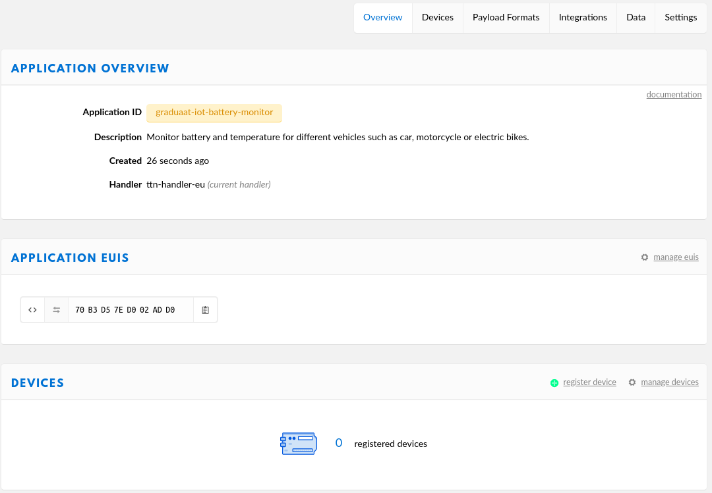
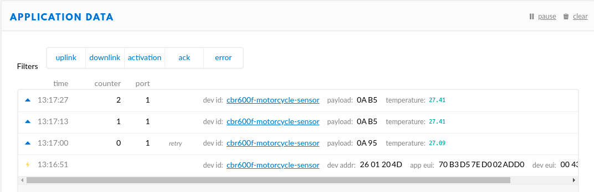

# <!-- fit --> LoRaWAN

Nico De Witte
bereikbaar via [nico.dewitte@vives.be](mailto:nico.dewitte@vives.be)

---

# Doel

Kennis maken met LoRaWAN om data van de sensor (the thing - Sodaq Explorer) naar de cloud te brengen bij The Things Network (TTN).


---

# LoRaWAN

LoRaWAN (Long Range Wide Area Network) is een specificatie voor telecommunicatie geschikt voor langeafstandscommunicatie (10-15km) met weinig vermogen.

De technologie wordt gebruikt voor machine-naar-machine communicatie en het Internet of Things.

---


---

# Architectuur

De architectuur bestaat uit *gateways*, *netwerkservers* en *applicatieservers*.


---

# LoRa transceiver

De nodes maken gebruik van RF-chips van Semtech die een draadloze ontvanger en zender implementeren (lora transceiver). De nodes versturen een versleuteld bericht via de lora transceiver. In Europa is dit op een frequentie van 868 MHz.


---

# Gateways

De berichten wordt ontvangen door de gateway(s). De gateway is verbonden met het Internet en stuurt het bericht door naar de cloud infrastructuur van The Things Network (TTN).


---

# De cloud infrastructuur

Bevat onder andere

* netwerk servers
* join servers
* applicatie servers


---

# De TTN Console

Een webapplicatie doet dienst als interface voor de gebruiker.

Vooraleer je met dit alles aan de slag kan dien je echter wel eerst een account te maken op [https://www.thethingsnetwork.org/](https://www.thethingsnetwork.org/). Druk bovenaan op `Sign Up` en vul je gegevens in.

---

# The Things Network

The Things Network bouwt een globaal gedistribueerd, crowd-sourced en open IoT datanetwerk dat eigendom is, en opgezet wordt door zijn gebruikers.

Door gebruik te maken van LoRaWAN technologie voorziet The Things Network een end-to-end stack: van sensoren (de nodes), gateways, netwerk servers, sensor beheer en integratie met cloud providers en IoT platformen. Alles is volledig veilig geïmplementeerd en configureerbaar door de eindgebruiker.

---

## Nieuwe TTN applicatie maken

Sensoren kunnen communiceren met een `applicatie` van The Things Network waarin ze geregistreerd worden. Om sensoren te registreren moet er eerst een applicatie gebouwd worden.

Je kan een applicatie bouwen door te surfen naar The Things Network [https://console.thethingsnetwork.org](https://console.thethingsnetwork.org) en te kiezen voor `Applications => Add Application`

---

## Nieuwe TTN applicatie maken

Daar dien je een aantal gegevens in te geven:

* **Application ID**: Hier kies je zelf een uniek *ID* dat bestaat uit kleine alfanumerieke letters. Spaties zijn niet toegestaan, maar een `-` teken wel.
* **Application description**: Hier kan je een kleine beschrijving plaatsen over de applicatie die je wil toevoegen.

---


---

## Nieuwe TTN applicatie maken

Klik dan op **Add Application** om te eindigen. Je zal doorverwezen worden naar de toegevoegde applicatie pagina. Hier zal je de gegenereerde **App EUI** en **Access Keys** terugvinden (deze hebben we later nog nodig).



---

### Nieuwe sensor maken

Vooralleer een sensor kan communiceren met The Things Network moeten we deze registreren in de correcte applicatie.

Open de applicatie in The Things Network en klik op **Register device**. Er zullen een aantal gegevens gevraagd worden:

* **Device ID**: Hier kies je zelf een uniek *ID* dat bestaat uit kleine alfanumerieke letters. Spaties zijn niet toegestaan, maar een `-` teken wel.
* **Device EUI**: Druk op het :twisted_rightwards_arrows: icoontje om een willekeurige EUI te berekenen bij het aanmaken van de sensor.
* **App Key**: Deze laten we ook automatisch genereren.

---


---

### Nieuwe sensor maken

Klik op **Register** om te eindigen. Je zal doorverwezen worden naar de overzichtspagina van de nieuwe sensor. Daar kan je de nodige gegevens (`DevEUI`, `AppEUI` en `AppKey`) vinden die we straks in de code zullen moeten gebruiken.


---

## Sodaq LoRaWAN voorbeeld

`Hello world` voorbeelden zijn bij programmeren de meest eenvoudige voorbeelden om iets aan te tonen. Dit voorbeeld geeft het meest eenvoudige programma om de temperatuur van de ingebouwde sensor te verzenden via LoRaWAN.

---

### Todo

In de code staat hier en daar wat commentaar met de tekst `TODO:`. Deze tekst wordt door programmeurs gebruikt om zich er aan te herinneren dat er nog iets gedaan moet worden. Kijk dus uit naar `TODO:` tekst, je zal daar optioneel of verplicht nog iets moeten aanpassen.

---

## DevEUI, AppEUI en AppKey

Elke LoRaWAN toepassing heeft een aantal instellingen die in de code juist ingesteld moeten worden.

* **DevEUI**: Unieke identificatie van de sensor.
* **AppEUI**: Identificatie van de `App` waartoe de sensor behoort.
* **AppKey**: Encryptiesleutel voor de `App` zodat niemand jouw gegevens kan zien.

Zonder de juiste gegevens komen jouw sensorwaarden niet aan bij de juist applicatie. Vergeet deze dus zeker niet aan te passen in je code. De exacte waarden kan je terug vinden in de console van de Things Network.

---

## Bibliotheken

Nu de sensor geconfigureerd is kunnen we deze ook gaan programmeren. Dit doen we in de Arduino IDE.

Bibliotheken: Zorg dat de benodigde bibliotheken geïnstalleerd zijn via de Arduino bibliotheken manager: `Schets -> Bibliotheek gebruiken -> Bibliotheken beheren`

Installeer de `Sodaq_RN2483` en `Sodaq_wdt` bibliotheken.

Zorg er ook voor dat het juiste `Board` geselecteerd (`SODAQ Explorer`) is onder `Hulpmiddelen -> Board`

---

### Voorbeeld LoRaWAN

```cpp
#include <Sodaq_RN2483.h>

#define debugSerial SerialUSB
#define loraSerial Serial2

//**********************************************************
// TODO: verander de waarden van DevEUI, AppEUI en APPkey
//**********************************************************
static uint8_t DevEUI[8] = { 0x00, 0x00, 0x00, 0x00, 0x00, 0x00, 0x00, 0x00 };
const uint8_t AppEUI[8] = { 0x00, 0x00, 0x00, 0x00, 0x00, 0x00, 0x00, 0x00 };
const uint8_t AppKey[16] = { 0x00, 0x00, 0x00, 0x00, 0x00, 0x00, 0x00, 0x00, 0x00, 0x00, 0x00, 0x00, 0x00, 0x00, 0x00, 0x00 };
```

---

### Voorbeeld LoRaWAN

```cpp
//**********************************************************
// TODO: De poort waarop de data wordt verzonden
//       Andere poort per type sensor
//**********************************************************
const int LORAWAN_PORT = 1;
```

---

### Voorbeeld LoRaWAN

```cpp
//**********************************************************
// WARNING:   Niet aanpassen. Maakt de buffer voor data.
//            De grootte mag worden aangepast als je meer
//            data wil verzenden.
//**********************************************************
const int SIZE_OF_BUFFER = 32;
uint8_t buffer[SIZE_OF_BUFFER];
```

---

### Voorbeeld LoRaWAN

```cpp
//**********************************************************
// De spread factor waarmee we zenden
//**********************************************************
const int SPREAD_FACTOR = 7
```

---

### Voorbeeld LoRaWAN

```cpp
//**********************************************************
// De setup van Arduino, wordt in het begin 1x uitgevoerd.
//    - Hier initialiseren we alles (LEDs, Seriele poort,
//      LoRa transceiver)
//**********************************************************
void setup()
{
  // Configuratie van de gekleurde LEDs
  pinMode(LED_RED, OUTPUT);         // Rode LED als uitgang
  pinMode(LED_GREEN, OUTPUT);       // Groene LED als uitgang

  digitalWrite(LED_GREEN, HIGH);    // Groen uit
  digitalWrite(LED_RED, LOW);       // Rood aan
  
  // Even wachten op de seriele monitor
  SerialUSB.begin(115200);
  while ((!SerialUSB) && (millis() < 5000));
  debugSerial.println("Starten van LoRaWAN Temperatuur Sensor");

  // Configuratie van LoRaWAN
  setup_lorawan();
}
```

---

### Voorbeeld LoRaWAN

```cpp
//**********************************************************
// De loop van Arduino, deze blijft telkens herhalen
//    - Hier bepalen we de sensorwaarden en versturen
//      we die vervolgens via LoRaWAN
//**********************************************************
void loop()
{
  // Periodiek temperatuur sensor uitlezen
  ready_temperature_for_sending();

  // Verzenden met LoRaWAN
  send_with_lorawan(2);     // 2 bytes in buffer

  // Tijd om te wachten (milliseconden)
  delay(10000);
}
```

---

### Voorbeeld LoRaWAN

```cpp
//**********************************************************
// Uitlezen van de temperatuur sensor
//**********************************************************
void ready_temperature_for_sending()
{
    //10mV per C, 0C is 500mV
    float mVolts = (float)analogRead(TEMP_SENSOR) * 3300.0 / 1023.0;
    float temperature = (mVolts - 500.0) / 10.0;

    // Uitschrijven in console
    debugSerial.print("Huidige temperatuur: ");
    debugSerial.println(temperature);

    // Buffer vullen met onze data (temperatuur)
    buffer[0] = ((int)(temperature * 100) >> 8) & 0xFF;
    buffer[1] = ((int)(temperature * 100) >> 0) & 0xFF;
}
```

---

### Voorbeeld LoRaWAN

```cpp
//**********************************************************
// WARNING:   Vanaf hier dien je niets meer aan te passen.
//            Dit zijn de functies die de LoRa data verzenden.
//**********************************************************
void setup_lorawan()
{
  loraSerial.begin(LoRaBee.getDefaultBaudRate());
  LoRaBee.init(loraSerial, LORA_RESET);
  if (LoRaBee.initOTA(loraSerial, DevEUI, AppEUI, AppKey, true)) {
    debugSerial.println("Verbonden met het LoRaWAN netwerk");
    digitalWrite(LED_GREEN, LOW);
    digitalWrite(LED_RED, HIGH);
  }
  else {
    debugSerial.println("Connectie met LoRaWAN netwerk gefaald. Zijn de keys ok?");
  }
  LoRaBee.setSpreadingFactor(SPREAD_FACTOR);
}
```

---

### Voorbeeld LoRaWAN

```cpp
void send_with_lorawan(unsigned int size) {
  if (size > SIZE_OF_BUFFER) {
    debugSerial.println("Buffer is kleiner dan het aantal bytes dat je wil verzenden");
    return;
  }

  switch (LoRaBee.send(LORAWAN_PORT, buffer, numberOfDataBytes))
  {
    case NoError:
      debugSerial.println("Packet succesvol verzonden");
      break;
    case NoResponse:
      debugSerial.println("Er was geen response van de transceiver.");
      break;
    case Timeout:
      debugSerial.println("Timed-out. Is de seriele connectie met de transceiver in orde? Er wordt voor 20sec gewacht.");
      delay(20000);
      break;
    case PayloadSizeError:
      debugSerial.println("Je probeert teveel data te versturen. Verzenden faalt hierdoor.");
      break;
    // ...
  }
}
```

---

### Voorbeeld LoRaWAN

De volledige code kan je vinden op GitHub: [https://github.com/BioBoost/graduaat-iot-slide-deck](https://github.com/BioBoost/graduaat-iot-slide-deck). Dan navigeren naar `code/04-lorawan/hello-world-temperature/`.

---

### The Things Network Decoder

Wanneer de data op de TTN binnenkomt dan zijn dit ruwe bytes. Dit is vrij low-level en zou de eindapplicatie dwingen om de ruwe data om te zetten naar eigenlijke informatie. We kunnen dit proces door de TTN laten doen. Dit maakt debuggen makkelijker en zorgt er ook voor dat een applicatie die gebruik wil maken van de data dit niet meer hoeft te doen.

---

### The Things Network Decoder

Open je applicatie op de [console](https://console.thethingsnetwork.org/applications) van The Things Network.


Klik bovenaan rechts op `Payload Formats`.

---

### The Things Network Decoder

We kunnen nu in het venster een stukje JavaScript code plaatsen die de raw bytes omzet naar een meer leesbaar en verwerkbaar formaat. Typisch gebruiken we voor deze dingen JSON.


---

### The Things Network Decoder

Kopieer onderstaande JavaScript code en plaats dit in het `decoder` venster.

```js
function Decoder(bytes, port) {
  // Decode an uplink message from a buffer
  // (array) of bytes to an object of fields.
  var decoded = {};

  if (port === 1) {
    decoded.temperature = ((bytes[0] << 8) + bytes[1])/100.0;
  }

  return decoded;
}
```

Ook terug te vinden op GitHub: [https://github.com/BioBoost/graduaat-iot-slide-deck](https://github.com/BioBoost/graduaat-iot-slide-deck). Dan navigeren naar `code/04-lorawan/hello-world-temperature/`.

---

### The Things Network Decoder


Klik vervolgens op `Save`.

---

### The Things Network Decoder

De data zou nu moeten worden voorgesteld in JSON formaat:


