<!-- Source: https://docs.allthingstalk.com/networks/use-the-things-network/ -->

# <!-- fit --> All Things Talk

Nico De Witte
bereikbaar via [nico.dewitte@vives.be](mailto:nico.dewitte@vives.be)

---

# Doel

Kennis maken met een IoT platform om data afkomstig van sensoren te visualiseren in een dashboard.


---

# All Things Talk

AllThingsTalk voorziet een schaalbaar **IoT platform** op de markt dat kan worden gebruikt als een **flexibele en snelle prototype omgeving** of als **productie-omgeving voor de volledige uitrol van verbonden producten**. Dit laatste valt onder de noemer AllThingsTalk Cloud.

AllThingsTalk begeleidt klanten in elke fase van het IoT-innovatieproces met ideeën en snelle prototyping-tools met behulp van de AllThingsTalk Cloud om verbonden producten te beheren en de toegang van gebruikers tot gegevens te organiseren.

AllThingsTalk is een **Belgisch bedrijf gevestigd in Gent**, en heeft een filiaal in Belgrado, Servië, waar een team van ontwikkelaars kantoor houdt.

---

# Account Maken

Surf naar [https://www.allthingstalk.com/](https://www.allthingstalk.com/) en maak een account aan.

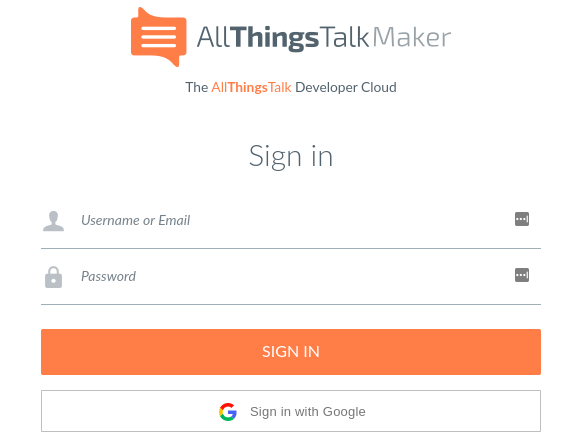

---

# Integraties

Integraties zijn de eenvoudigste manier om **devices te verbinden met een applicatie**. Een integratie maakt gebruik van dezelfde API's of SDK's die een toepassing rechtstreeks zou kunnen gebruiken. Samen met de private of publieke API's van het platform verbindt het de applicatie die op het platform draait met The Things Network.

---

# Integraties van TTN

TTN voorziet infrastructuur om LoRaWAN berichten te verzamelen en beschikbaar te stellen aan de ontwerper. Zij voorzien geen mogelijkheid om een app te hosten. Integraties leggen de koppeling tussen TTN en een app platform zoals AllThingsTalk.

En er zijn er nog meer ...

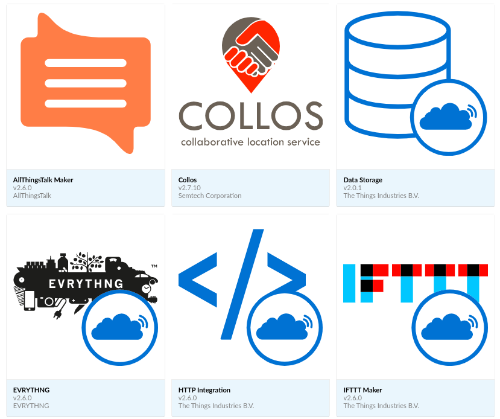

---

# Opzetten integratie met AllThingsTalk

Ga naar je applicatie op de console van The Things Network [https://console.thethingsnetwork.org/applications](https://console.thethingsnetwork.org/applications) en op het tabblad **Integrations** rechts boven.

Kies vervolgens voor **AllThingsTalk Maker (v2.6.0)**

---

# Configuratie van de integratie

Vul een deftig en beschrijvend **Process ID** in voor de integratie tussen de TTN applicatie en All Things Talk. Bv. `all-things-talk-integration`.

Selecteer tevens een **Access Key** voor de downlink messages. Hier mag je de `default key` selecteren.

---

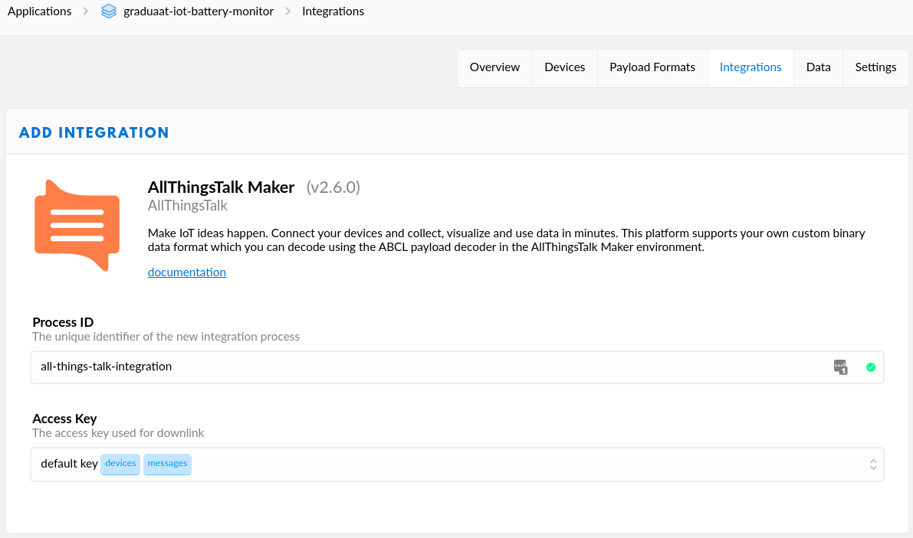

---

# Creatie van een Ground

Een ground is een logische group van devices. Je kan je vergelijken met een applicatie op The Things Network.

Start met het maken van een nieuwe ground.

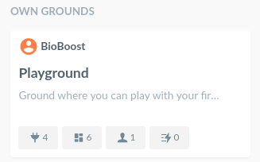

---

# Configuratie van het Device

Vooraleer we de data van de sensoren (de assets) kunnen visualiseren dienen we eerst een device te registreren.

Open de ground en klik op `Connect a Device`.

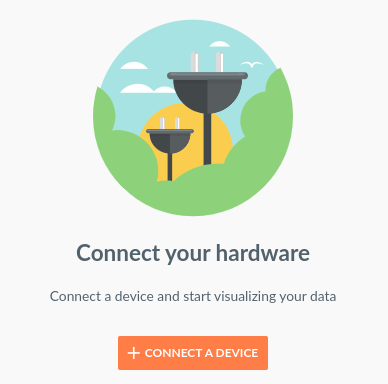

---

# Configuratie van het Device

Je krijg nu een keuzelijst met populaire devices. Of je kan je eigen custom device toevoegen.

Ga op zoek naar `Your own LoRa device`.

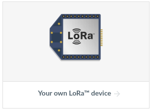

---

# Configuratie van het Device

Vervolgens dien je de data provider aan te geven. In ons geval is dit `The Things Network`.

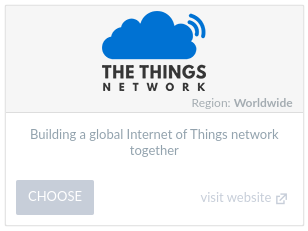

---

# Toegang tot TTN

Vervolgens dienen we All Things Talk toegang te geven tot de data van onze sensor. Dit gebeurt door de correct gegevens in te vullen die overeenstemmen met deze van TTN.

* Device name kies je zelf, bv. `CBR600F Battery Monitor`
* Device EUI is een key die je vind op TTN
* Application ID is het ID van je volledige applicatie op TTN, bv. `graduaat-iot-battery-monitor`
* Activation method is `OTAA`
* Application EUI is een key die je vind op TTN

Eens alles correct ingevuld, klik je op `Connect`.

---

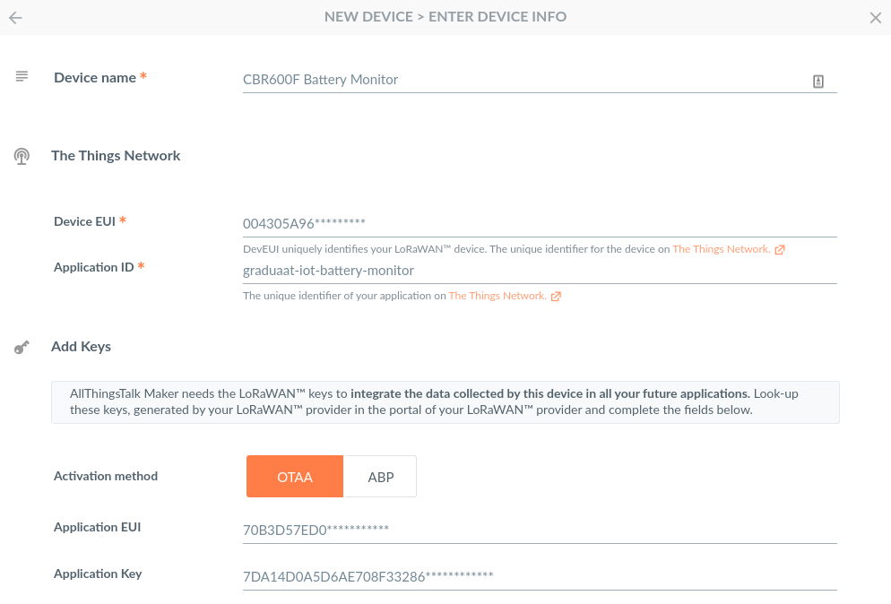

---

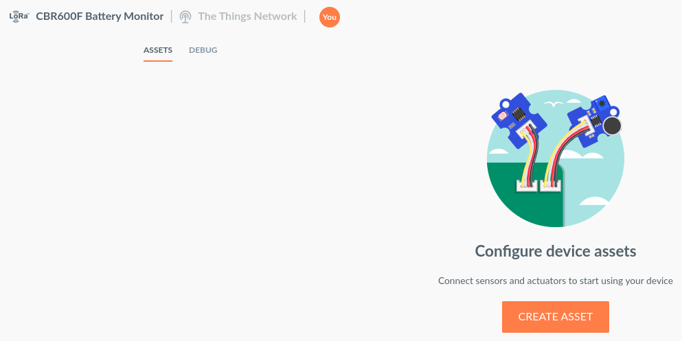

---

# Ontvangen van sensor data

Nu moet worden aangegeven wat voor data ons device zal aanleveren. Elke waarde (temperatuur, spanning, ...) wordt een **asset** genoemd.

Klik op `Create Asset` om een waarde toe te voegen aan de sensor.

---

# Temperatuur ontvangen

Selecteer `Sensor` als *Kind* omdat het een sensorwaarde is die we binnen krijgen.

Kies vervolgens een duidelijke naam voor de asset, bv. `battery-temperature`.

---

# Temperatuur ontvangen

Vervolgens dien je het type van de waarde aan te geven. Selecteer `Number` (kommagetal) uit de keuzelijst en klik vervolgens op `Advanced`. Dit laat toe om nog wat extra properties toe te voegen zoals de eenheid (hier graden celsius).

```json
{
    "type": "number",
    "unit" : "°C"
}
```

Meer informatie kan je hier vinden: [https://docs.allthingstalk.com/cloud/concepts/assets/](https://docs.allthingstalk.com/cloud/concepts/assets/).

Klik vervolgens op `Create Asset`.

---

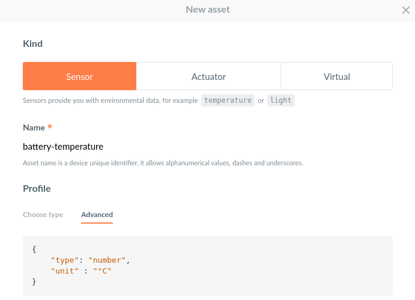

---

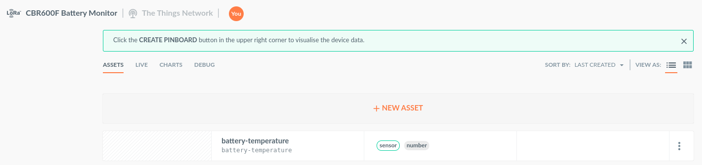

---

# Breng je device online

Tijd om je device online te brengen. Neem zeker ook een kijkje op TTN om na te gaan of er data binnen komt.

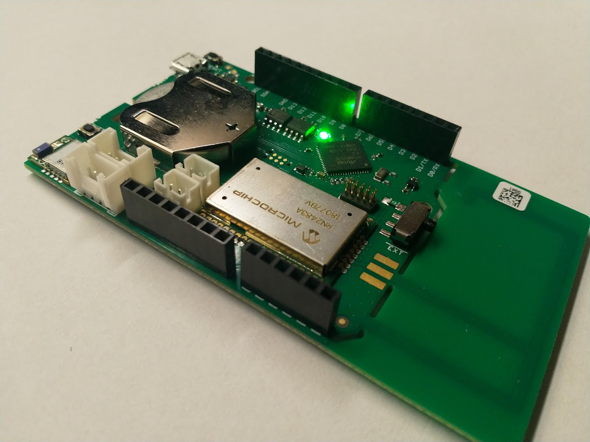

---

# Er loopt iets mis

Op dit moment wordt de data nog niet gevisualiseerd.

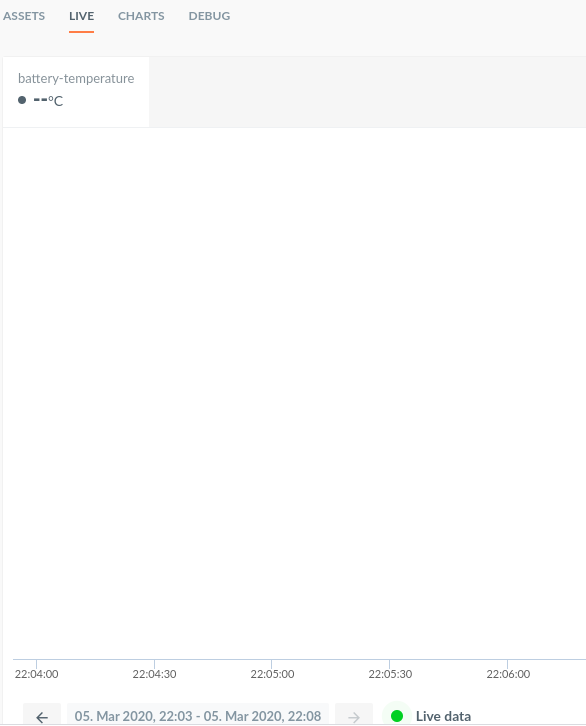

---

# Er loopt iets mis

Wanneer we naar het `Debug` tabblad gaan zien we dat er inderdaad foutberichten worden gegenereerd.

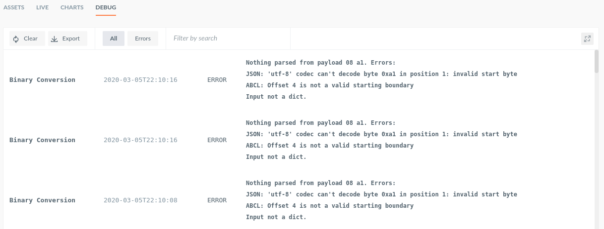

---

# Er loopt iets mis

All Things Talk verstaat eigenlijk onze device niet. Het weet niet hoe onze data is gestructureerd.

Op dit moment probeert All Things Talk de data te aanzien als CBOR geformateerd: [https://docs.allthingstalk.com/networks/use-the-things-network/#actuate-your-device-with-cbor](https://docs.allthingstalk.com/networks/use-the-things-network/#actuate-your-device-with-cbor)

---

# Data Conversie

We moeten aan All Things Talk aangeven hoe onze data eruit ziet. Dit kunnen we doen aan de hand van een decoder (vergelijkbaar aan deze van de TTN).

Klik bovenaan rechts op `Settings => Payload formats`.

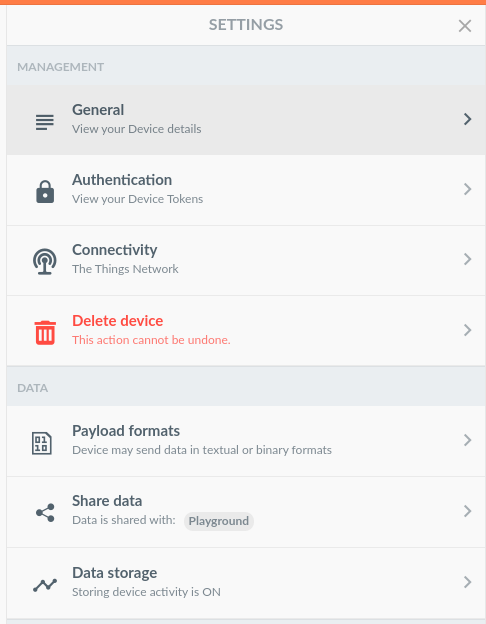

---

# Data Conversie

Vink vervolgens `Use ABCL to convert custom binary data` aan wat toelaat om zelf de decoder te bouwen.

Vul nu het volgende in

```json
{
   "sense":[
      {
         "asset":"battery-temperature",
         "value":{
            "byte": 0,
            "bytelength": 2,
            "type":"integer",
            "calculation":"val/100"
         }
      }
   ]
}
```

---


---

# Experiment met PinBoard

Experimenteer zelf met `PinBoard` om een dashboard te maken met de temperatuur erop in een grafiek.

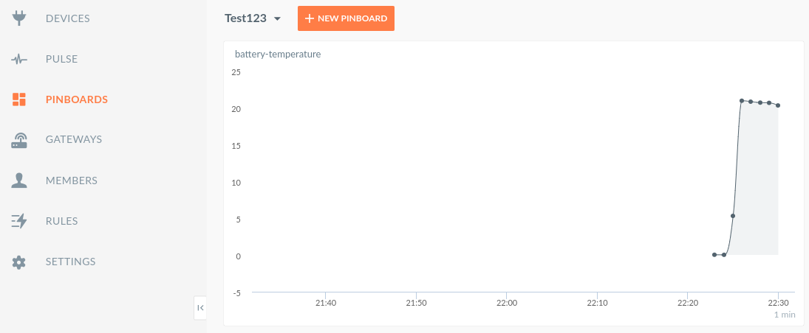

---

# Volledige Documentie

De volledige documentatie waarop deze slides deels gebaseerd zijn kan je terug vinden op de Docs van All Things Talk:

* [https://docs.allthingstalk.com/networks/use-the-things-network/#set-up-the-integration](https://docs.allthingstalk.com/networks/use-the-things-network/#set-up-the-integration)
* [https://docs.allthingstalk.com/developers/data/custom-payload-conversion/](https://docs.allthingstalk.com/developers/data/custom-payload-conversion/)
