<!-- Source: https://docs.allthingstalk.com/networks/use-the-things-network/ -->

# <!-- fit --> Node-RED

Nico De Witte
bereikbaar via [nico.dewitte@vives.be](mailto:nico.dewitte@vives.be)

---

# Doel

Binnenhalen van onze data uit de cloud (The Things Network) naar onze eigen services.


---

# Node-RED

Node-RED is een flow gebaseerde visuele ontwikkelomgeving ontwikkeld door IBM. Het laat toe hardware toestellen, API's en online diensten met elkaar te communiceren in het teken van het Internet of Things.

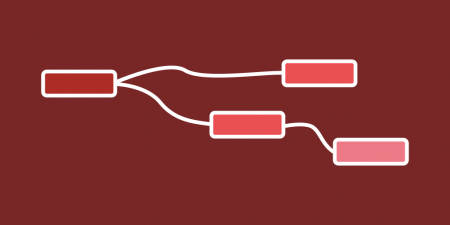

---

# Node-RED

Het biedt een browsergebaseerde editor die het gemakkelijk maakt om flows met elkaar te verbinden met behulp van het brede scala aan nodes die met een klik kunnen worden ingezet tijdens de uitvoering.

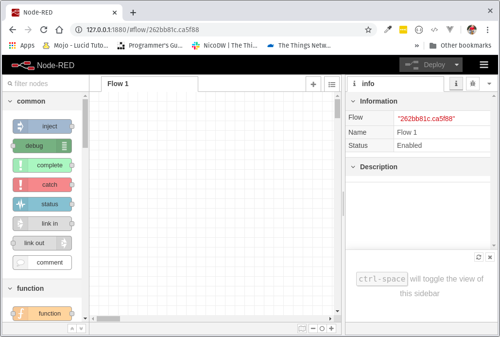

---

# Node-RED

Flows kunnen tevens heel makkelijk worden geëxporteerd of geïmporteerd als JSON.

---

# Node.js gebasseerd

Node.js is een **open-source**, **platform-onafhankelijke** JavaScript runtime omgeving die JavaScript-code buiten een browser uitvoert.

De lichtgewicht runtime is gebouwd op Node.js en profiteert volledig van het event-based, non-blocking async model. Dit maakt het ideaal om aan de rand van het netwerk te draaien op goedkope hardware zoals de Raspberry Pi en in de cloud.

Met meer dan 225.000 modules in de packet repository van Node, is het eenvoudig om gamma aan nodes uit te breiden en zo nieuwe mogelijkheden toe te voegen.

---

# Installeren van Node.js

Start met installeren van Node.js. Surf hiervoor naar [https://nodejs.org/en/](https://nodejs.org/en/).

Selecteer de LTS (Long Term Support) versie (12.16).

Volg de wizard om Node.js te installeren.

---

# Testen van Node.js

Open een `powershell` venster en type volgende command:

```bash
node --version
```

De output zo ongeveer het volgende moeten zijn:

```bash
v12.16.1
```

---

# Installeren van Node-RED

Om Node-RED te installeren dien je volgende command uit te voeren in `powershell`:

```bash
npm install -g --unsafe-perm node-red
```

Herstart nu voor alle zekerheid je computer.

---

# Starten van Node-RED

Node-RED dient te worden opgestart. Dit kan je realiseren door onderstaand commando uit te voeren in een `powershell` venster:

```bash
node-red
```

Dit dien je telkens opnieuw te doen als je Node-RED wil gebruiken.

---

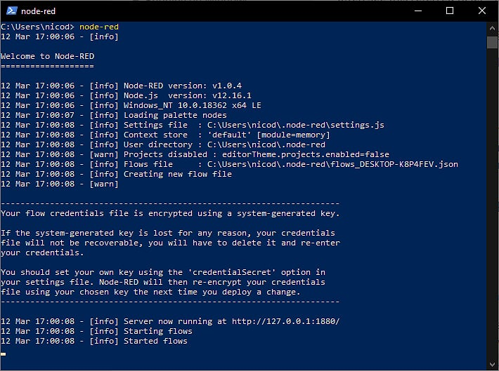

---

# Werken met Node-RED

Open een browser en surf naar [http://127.0.0.1:1880](http://127.0.0.1:1880).


---

# Data van TTN binnenhalen

Om data van The Things Network binnen te halen dient er een flow gebouwd te worden. De connectie met TTN wordt gemaakt aan de hand van MQTT.

---

# MQTT

MQTT is één van de meest gebruikte protocollen voor Internet of Things apparaten te laten communiceren met elkaar.

MQTT staat voor Message Queuing Telemetry Transport. Het is een zeer lichtgewicht berichten protocol dat gebruik maakt van publish/subscribe mechanisme om gegevens tussen verschillende clients uit te wisselen.

Het is klein in formaat, laag in vermogenverbruik en gebruikt geminimaliseerde data paketten, ideaal voor 'machine tot machine' of Internet of Things.

---

# Publiceren en abonneren

Stel dat je een temperatuur sensor hebt. Deze wil zijn waarden doorsturen naar een MQTT broker. Aan de andere kant hebben we toestellen zoals computers en smartphones die deze waarden willen ontvangen om ze weer te geven of te verwerken. Dan zijn er twee dingen die gebeuren.

* De sensor geeft een **topic** op waaronder het zijn gegevens zal publiceren. Bijvoorbeeld `temperatuur`. Dan zal het zijn temperatuurwaarde publiceren.

* Iedereen die de gegevens wil ontvangen kan zich dan gaan abonneren op `temperatuur`. Elke keer dat de sensor nieuwe gegevens publiceert worden alle abonnees automatisch verwittigd met de nieuwe temperatuur waarde.

---


---

# MQTT broker van TTN

Bij onze opstelling is er echter wel een groot verschil!

De sensor published zijn waarden bij ons niet via MQTT maar wel via LoRaWAN naar de TTN. The Things Network stelt echter onze data ter beschikking via MQTT. Zij voorzien dus met andere woorden de broker waar wij kunnen subscriben op onze data.

---

# MQTT Input

Zoek de node `mqtt input` in de lijst aan de linker kant, en sleep deze naar het centrale deel.

Vervolgens kunnen we ook een `debug` node aan de uitgang van de `mqtt input` node koppelen zodat we de informatie makkelijk kunnen raadplegen die van The Things Network komt.

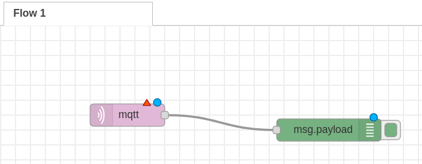

---

# Nodes - Input / Output

Merk op dat een node die data genereert (uitvoer) aan de rechterkant kan gekoppeld worden en een node die data binnen neemt (invoer) aan de linkerkant gekoppeld kan worden.


---

# MQTT Input - Configuratie

Dubbelklik op de mqtt input node om de configuratie te tonen. Hier dienen we de broker van The Things Network in te stellen.

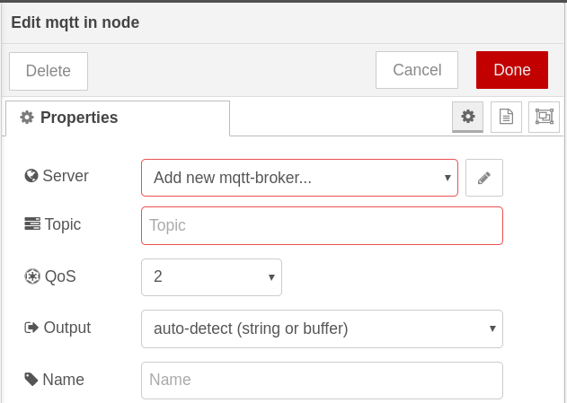

---

# MQTT Input - Connectie

Klik op de knop met het potlood icoontje, rechts naast het invoerveld `Add new mqtt broker...`. Eerst en vooral kan je de broker configuratie best een duidelijk naam geven zoals `TTN-vehicle-battery-monitor`.

Vervolgens dienen we in het tabblad **Connection** de server in te stellen op `eu.thethings.network`.

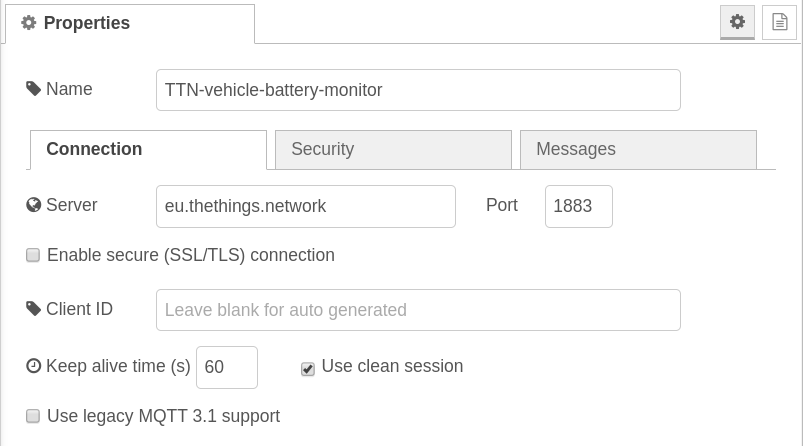

---

# MQTT Input - Security

Vervolgens moeten we een bruikersnaam en wachtwoord ingeven in het tabblad **Security**. Hiervoor moeten we het `App ID` (username) en de `Access Key` (password) van de The Things Network applicatie achterhalen. Deze gegevens kan je terugvinden op de console van The Things Network.

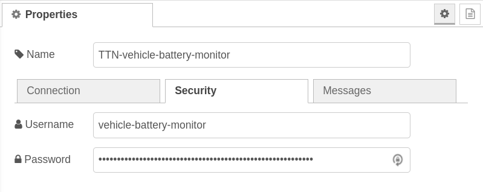

Klik vervolgens bovenaan rechts op de knop `Add`.

---

# MQTT Input - Het Topic instellen

Als laatste dienen we ook in te stellen waar onze data kan worden bekomen. Dit doen we door het topic in te stellen op basis van de naam die we aan ons device hebben gegeven. Dit kunnen we terug vinden op de [console](https://console.thethingsnetwork.org/) van The Things Network. Klik bovenaan rechts op Devices en kopieer de naam van je device.


---

# MQTT In - Het Topic Instellen

Het `device ID` dien je in het topic `+/devices/XXXX/up` in te vullen in plaats van `XXXX`.

Voor een device met id `sodaq-temperature-sensor` wordt dit dus: `+/devices/sodaq-temperature-sensor/up`

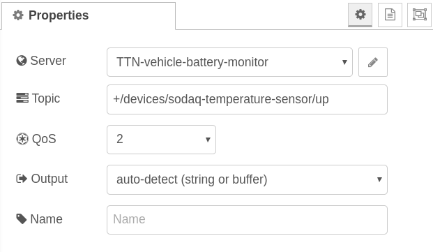

---

# MQTT In - Output als JS Object

Als laatste dienen we de mqtt node `Output` ook in te stellen zodat deze een JavaScript object terug geeft in plaats van een pure JSON string. Dit laat ons toe om later makkelijker te filteren. Selecteer als output `A parsed JSON Object`.

Klik als laatste bovenaan rechts op `Done`.

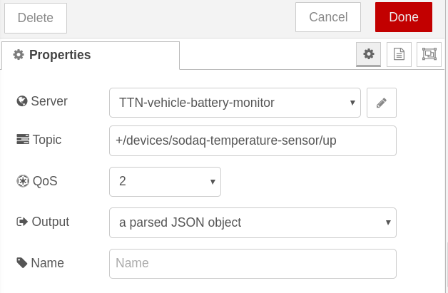

---


---

# Deployen van de flow

Klik bovenaan helemaal rechts op `Deploy` om de flow te activeren. Telkens je een aanpassing doet aan de flow dien je deze opnieuw te deployen.

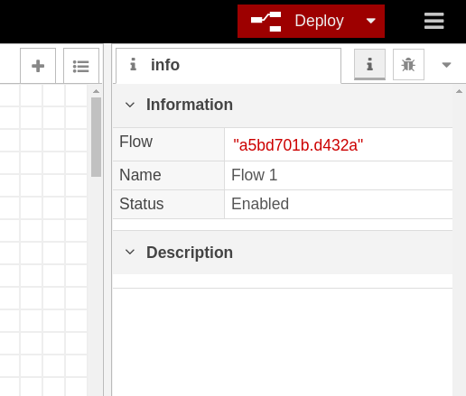

---

# MQTT - Connected

Indien alles goed is verlopen zou er nu onder `mqtt input` node `connected` moeten staan.

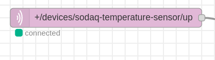

---

# Show Debug Messages

Indien je nu op het kleine debug beestje klikt rechts bovenaan in Node RED dan zou je reeds data moeten zien binnenkomen van je sensor.

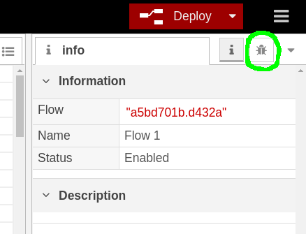

---

# Data zonder sensoren

Als je geen sensor hebt kan je toch data *faken* door naar de console van The Things Network te surfen en naar jouw device te gaan.

Daar heb je dan de sectie `Simulate Uplink`. Hier kan je een raw byte payload ingeven. Bv.: `06 BD 22`. Dit komt overeen met een temperatuur van `17.25` en een batterij percentage van `34`.

---

# Data zonder sensoren

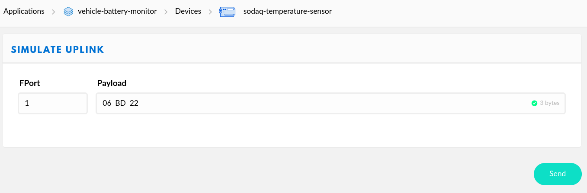

Klik op `Send` om de data te simuleren. Je zou dit vervolgens moeten zien binnenkomen in  Node-RED.

---

# Payload Fields

Zoals te zien in de figuur zit onze data gedecodeerd in het veld `payload_fields`. Dit komt er zo in te staan doordat we een decoder op de TTN hebben ingesteld voor onze data.

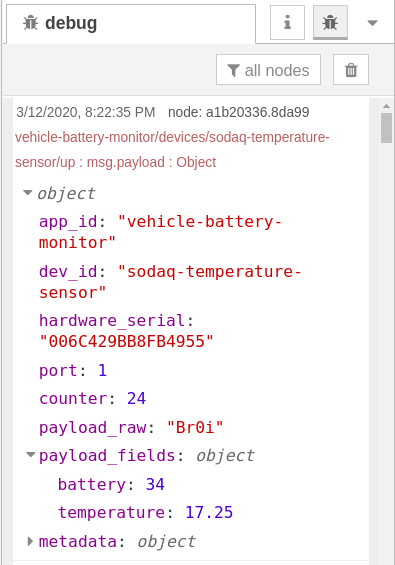

---

# Filteren - Te veel data

Op dit moment krijgen we niet enkel onze data binnen van de TTN maar ook allerlei metadata (`app_id`, `dev_id`, `port`, `counter`).

We dienen eerst onze data (die zich bevind onder `payload_fields`) er uit te filteren vooraleer deze verder kan verwerkt worden.


---

# Filteren - Te veel data

Hiervoor kan je gebruik maken van de algemene `function node`.

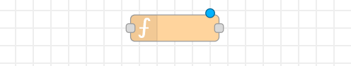

Als je hier op dubbelklikt kan je een stukje JavaScript code bouwen om uit te voeren.

---

# Filteren - Temperatuur

Om het payload field met de temperatuur eruit te filteren kan volgende code wordt gebruikt.

```js
msg.payload = msg.payload.payload_fields.temperature;
return msg;
```

Geef de node best een goede `Name` zoals `Filter temperatuur`.

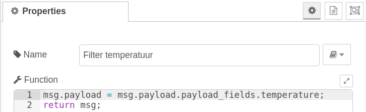

---

# Filteren - Temperatuur

Als je op `Done` klikt kan je nu de `function` node verbinden met de `mqtt input` node. Het is ook een goed idee om aan de uitgang van de `function` node een `debug` node te hangen zoals in de figuur. Dit laat toe de output te bekijken.

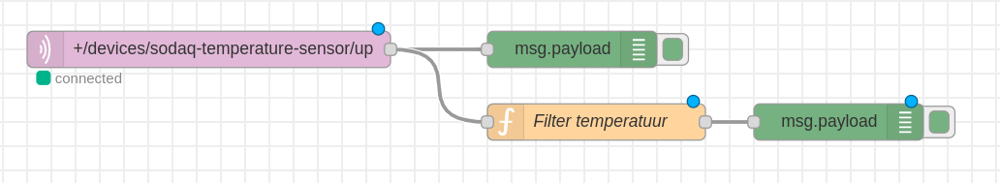

---

# Filteren - Temperatuur

Als je de flow deployed en opnieuw via de console van de TTN data simuleert zou het effect moeten te zien zijn in Node-RED debug.

Merk op dat we de temperatuur nu apart krijgen.

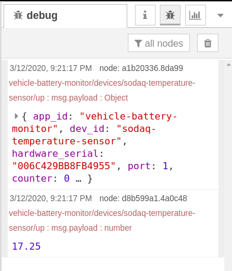

---

# Oefening - Batterij percentage

Probeer nu hetzelfde voor de batterij. Je zou volgende resultaat moeten bekomen.

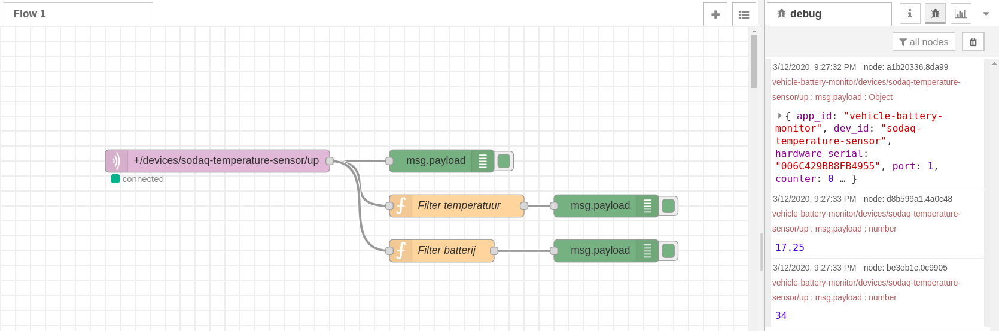
