<!-- Source: https://www.youtube.com/watch?v=7QOWxuuGYh4 -->

# <!-- fit --> Node-RED Dashboard

Nico De Witte
bereikbaar via [nico.dewitte@vives.be](mailto:nico.dewitte@vives.be)

---

# Doel

De data die reeds binnengehaald is van de TTN nu afbeelden op een dashboard systeem van Node-RED.

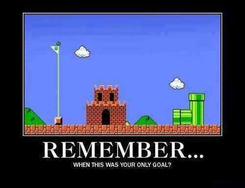

---

# Node-RED Dashboard

Node-RED Dashboard is een module voor Node-RED die een toolbox aanlevert om heel snel een live dashboard te bouwen voor je Node-RED flow.

Website: [https://flows.nodered.org/node/node-red-dashboard](https://flows.nodered.org/node/node-red-dashboard)

---

# Installeren Node-RED Dashboard

Node-RED Dashboard is niet standaard meegeleverd met Node-RED maar moet apart worden geïnstalleerd als module.

Klik rechts bovenaan op de menu-knop (drie strepen onder elkaar) en kies de optie `Manage Palette`.

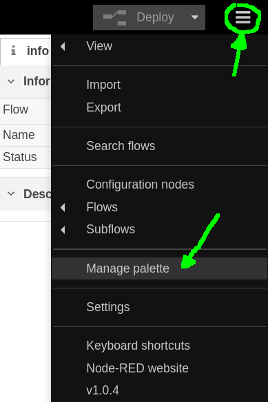

---

# Installeren Node-RED Dashboard

Open vervolgens het tabblad `Install` en zoek naar `dashboard`. Vervolgens klik je de `Install` knop voor de module `node-red-dashboard`.

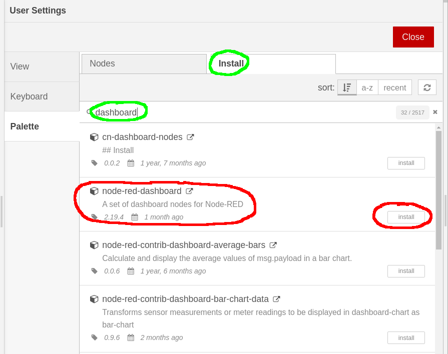

----

# Installeren Node-RED Dashboard

Klik op `Install` wanneer het dialoogvenster tevoorschijn komt.

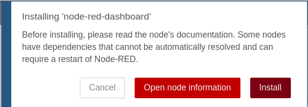

---

# Installeren Node-RED Dashboard

Als alles gelukt is zou er nu naast de module `Installed` moeten verschijnen.

Klik op Close om de overlay te sluiten en terug te keren naar de flow-editor.

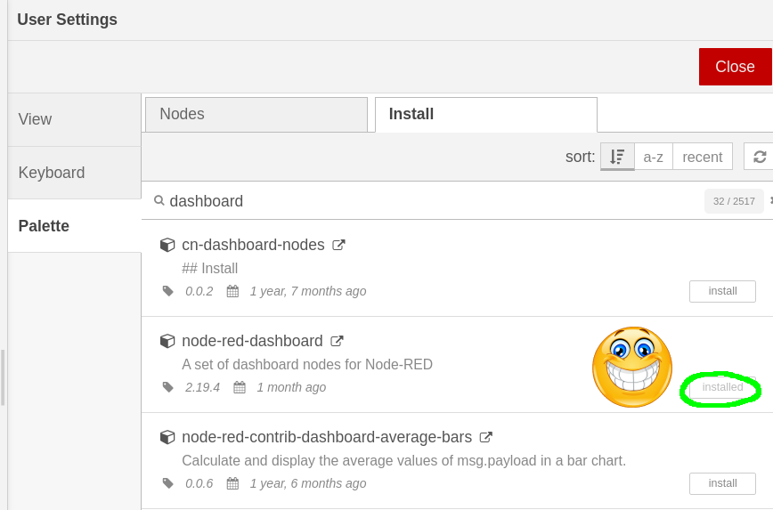

---

# Node-RED Dashboard Nodes

In Node-RED vind je nu rechts tussen de andere nodes de categorie `dashboard`. Je vindt hier allerhande nodes voor grafische input en output via het dashboard.

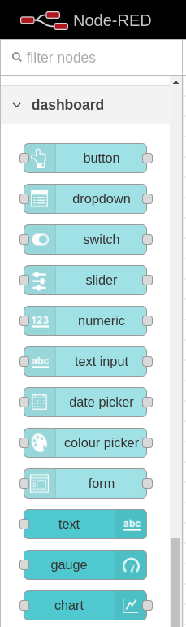

---

# Raadplegen Dashboard

Het dashboard kan je raadplegen door te surfen naar de URL [http://localhost:1880/ui](http://localhost:1880/ui). Merk op dat dit gewoon de URL is Node-RED met `/ui` erachter (ui = user interface).

Voorlopig krijg je de melding dat er nog geen dashboard bestaat.

---

# Introductie Node-RED Dashboard

Bekijk volgend filmpje vanaf **2min06** om de basis van Node-RED Dashboard te leren kennen:

[https://www.youtube.com/watch?v=X8ustpkAJ-U](https://www.youtube.com/watch?v=X8ustpkAJ-U)

Volg mee voor het bouwen van een flow en dashboard (doe dit in een nieuw werkblad). Klik bovenaan rechts op het plusje `+` om een nieuwe flow te maken.

Speel ook even zelf met de componenten.

---

# Korte Samenvatting - Grafische Componenten

* Een dashboard bestaat uit grafische componenten die data afbeelden en interactie met de gebruiker toelaten.
  * Denk maar aan grafieken, knoppen, textinvoer, ...

<!-- TODO: Merge two images -->
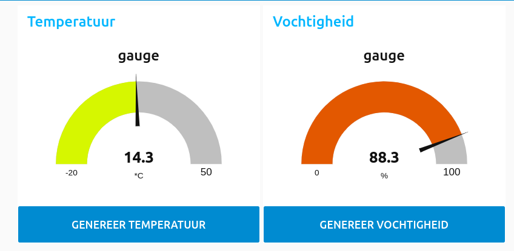
<!-- 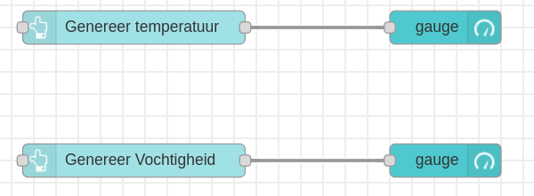 -->

---

# Korte Samenvatting - Groups en Tabs

* De grafische elementen worden ingedeeld in groepen (groups) en deze worden afgebeeld op een tabblad (tabs).
  * De groups en tabs kan je beheren via de Layout manager (rechts bovenaan de dashboard knop).

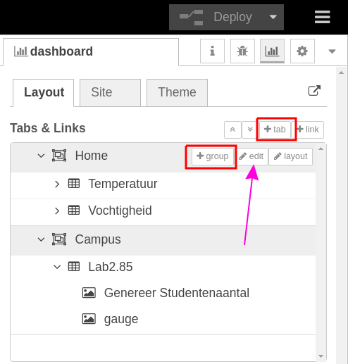

---

# Backup maken van je flows

Het begint tijd te worden dat we af en toe een backup maken van onze flow. Stel dat er iets misloopt met Node-RED willen we niet alles verliezen.

Klik bovenaan rechts op de 3 streepjes en selecteer `Export`.

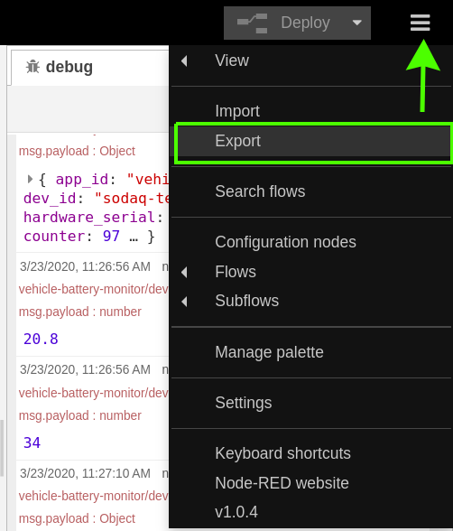

---

# Backup maken van je flows

Nu kan je de flow downloaden door op `Download` te klikken.

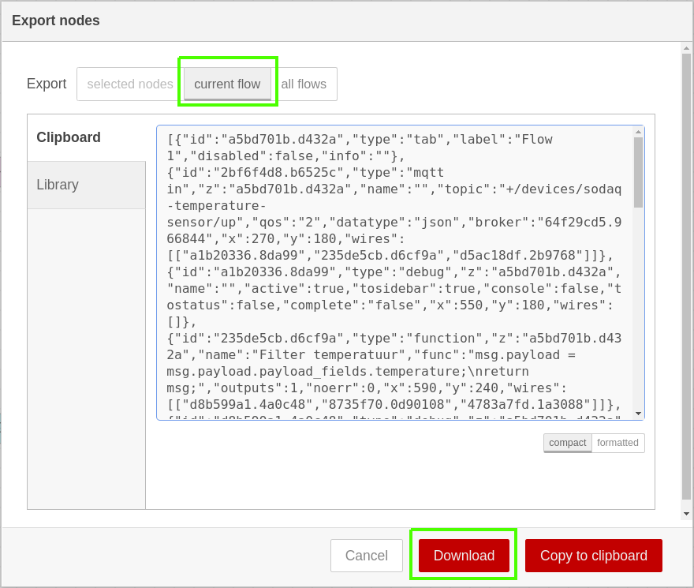

---

# Dashboard bouwen voor TTN

Tijd om een dashboard te bouwen voor onze applicatie (batterij monitoring systeem).

We gaan dit stapsgewijs aanpakken:

1. Group `Temperatuur` met `Gauge` en `Chart` voor de temperatuur aangestuurd met een `Button` die *fake* data genereert als test.
1. Vervangen van de `Button` door de TTN data
1. Testen van dashboard met *fake TTN data*
1. Toevoegen battery percentage in nieuwe group

---

# TTN Dashboard - Stap 1 - Temperatuur

Open de flow die je vorige keer hebt gemaakt voor het binnenhalen van de TTN data.

Start met hernoemen van het tabblad `Home` naar `Vehicle Battery Monitor` of iets dergelijks.

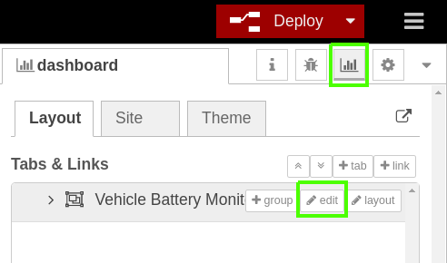

---

# TTN Dashboard - Stap 1 - Tabblad

Voeg een `button`, `gauge` en `chart` node toe uit de `dashboard` categorie.

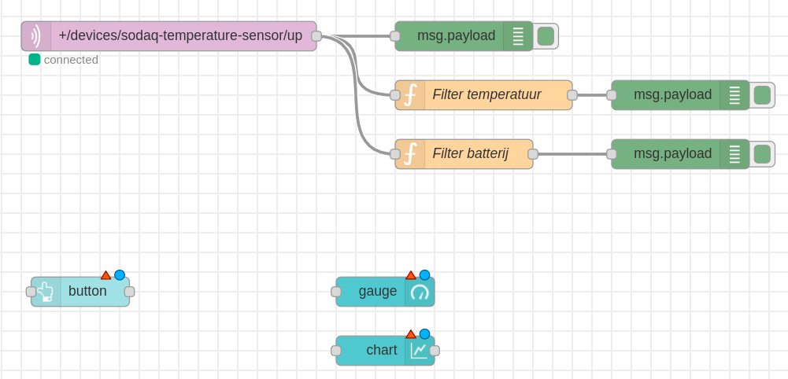

---

# TTN Dashboard - Stap 1 - De Button

Configuur volgende eigenschappen van de `button`:

* Plaats hem in de group `Temperatuur`
* Geef de knop een deftig label zoals `Genereer Fake Temperatuur`
* Zet de payload op een realistische temperatuur zoals `21.5` en stel het type in op `number` (dit is de waarde die de knop zal doorgeven aan de `gauge` en `chart`).

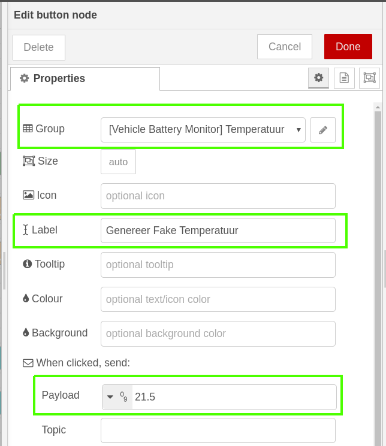

---

# TTN Dashboard - Stap 1 - De Gauge

Configuur volgende eigenschappen van de `gauge`:

* Plaats hem in de group `Temperatuur`
* Geef de gauge een deftig label zoals `Batterij Temperatuur`
* Zet de eenheid (`unit`) op `°C`
* Zet het bereik op een realistische waarde zoals `-20` tot `+70`. Speel gerust met de kleurwaarden.

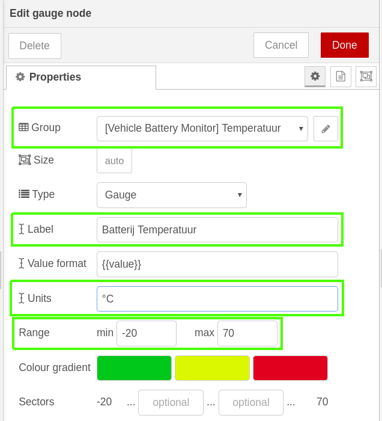

---

# TTN Dashboard - Stap 1 - De Chart

Configuur volgende eigenschappen van de `chart`:

* Plaats hem in de group `Temperatuur`
* Geef de chart een deftig label zoals `Temperatuur Historiek`
* Zet de y-as op de laatste `12 hours`
* Stel het bereik van de x-as in op minimum `-20` en maximum op `+70`

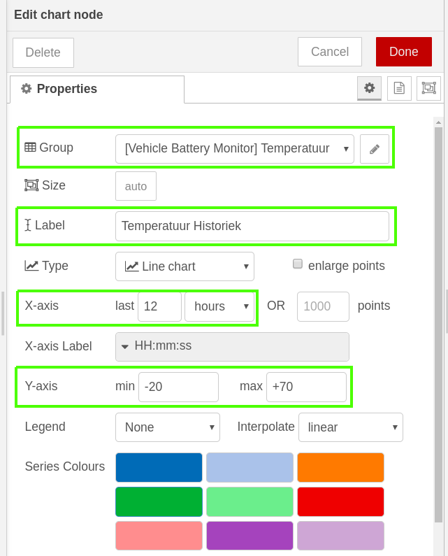

---

# TTN Dashboard - Stap 1 - Verbinden Nodes

Verbind nu de `button` output met de `gauge` input en ook met de `chart` input.

Klik vervolgens op `Deploy` om de flow en het bijhorend dashboard te deployen.

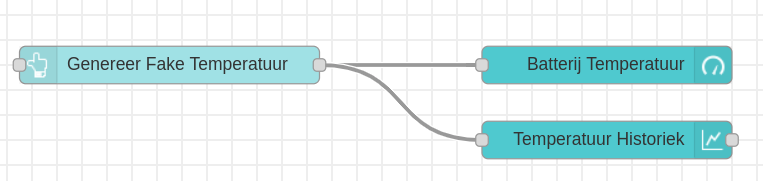

---

# TTN Dashboard - Stap 1 - Resultaat

Als je nu surft naar [http://localhost:1880/ui/](http://localhost:1880/ui/) zou je nevenstaand resultaat moeten bekomen.

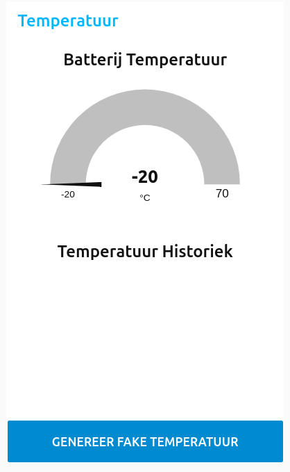

---

# TTN Dashboard - Step 1 - Genereer Data

Door op de knop te klikken genereren we nu telkens data.

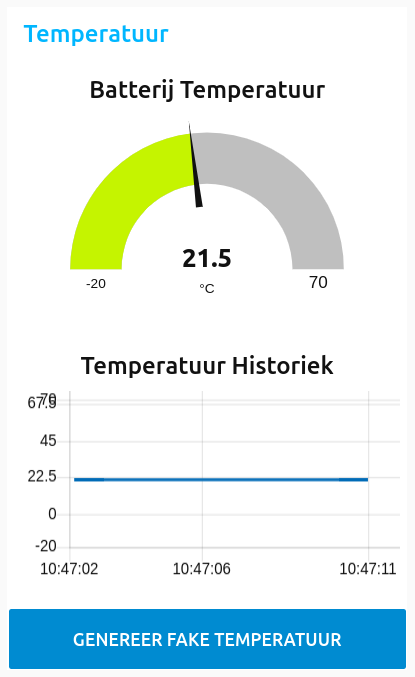

---

# TTN Dashboard - Step 2 - TTN Data

Onze volgende stap bestaat uit het vervangen van de `Button` door de TTN data.

Koppel de output van de `Temperatuur function node` van de TTN aan de `gauge` en de `chart` zoals in de figuur in volgende slide.

*Je hoeft de button niet weg te doen. Je mag deze voorlopig laten staan*

---

# TTN Dashboard - Step 2 - Deploy

Deploy de flow.

---

# TTN Dashboard - Step 3 - Fake TTN Data

Net zoals vorige keer zullen we onze data moeten *faken* op de console van de TTN.

Surf naar de console van The Things Network en ga naar jouw device.

Daar heb je dan de sectie `Simulate Uplink`. Hier kan je een raw byte payload ingeven. Bv.: `06 BD 22`. Dit komt overeen met een temperatuur van `17.25` en een batterij percentage van `34`.

Klik op `Send`.

---

# TTN Dashboard - Step 3 - Fake TTN Data

Normaal zou je de data moeten zien binnenkomen op je dashboard.

Merk op dat de `chart` automatisch een nieuwe tijdsseries (lichtblauw in figuur) aanmaakt (de chart herkent dat de data van andere input komt). Door meerdere outputs aan `chart` te hangen kan je dus met andere woorden meerdere grafieken tekenen op 1 chart.

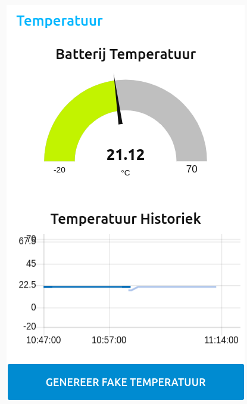

---

# TTN Dashboard - Step 4 - Opdracht

Tijd om zelf je handen vuil te maken.

Maak een nieuwe `group` aan genaamt `Batterij Percentage` met volgende componenten:

* `slider` om fake data te genereren (dit vervangt de functie van de temperatuur knop)
* `gauge` die tussen `0%` en `100%` toont
* `chart` die eveneens tussen `0%` en `100%` toont.

Volg de stappen zoals we dit gedaan hebben voor de temperatuur.

Geef alles duidelijke labels.

---

# TTN Dashboard - Resultaat

---

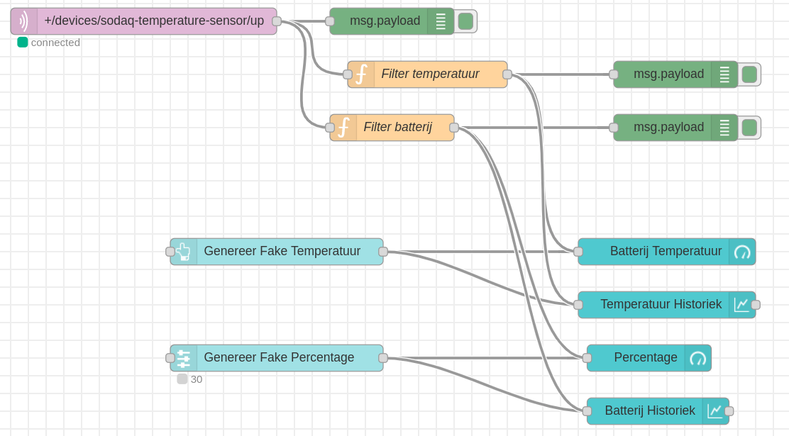

---

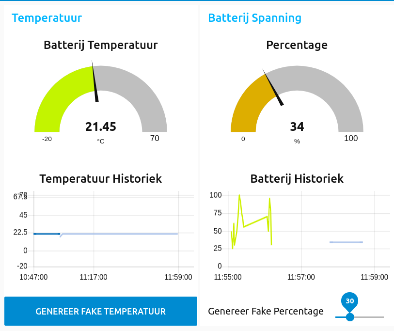
