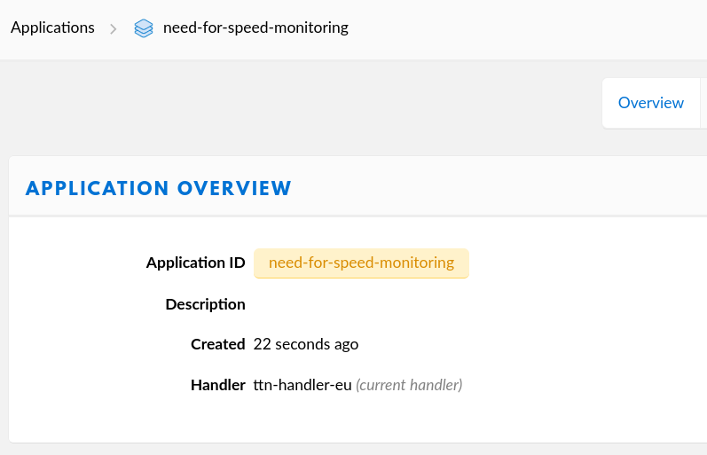
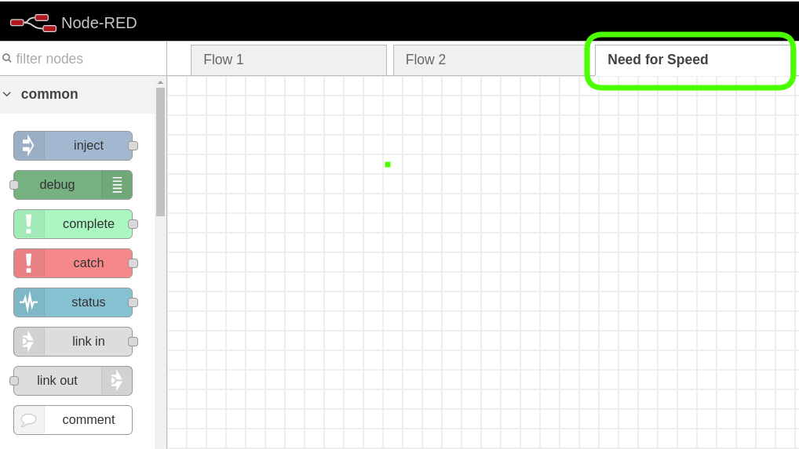
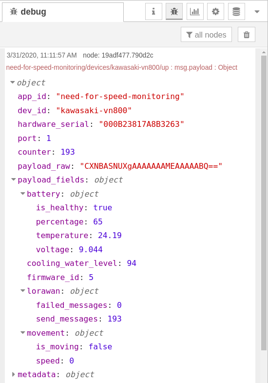
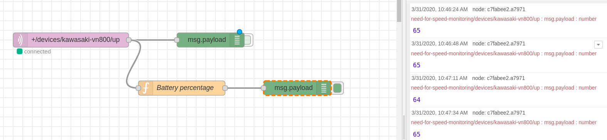
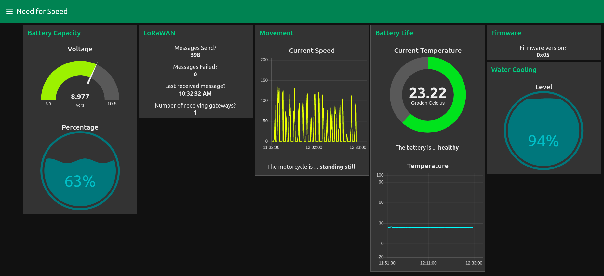

# <!-- fit --> MotorCycle Battery Manager

Nico De Witte
bereikbaar via [nico.dewitte@vives.be](mailto:nico.dewitte@vives.be)

---

# Doel

Koppeling maken met de TTN App van de docent vanuit Node-RED en dan ook bouwen van een dashboard. Je verslag is hier de leidraad in.

Daarnaast zal je ook hier en daar de slides van de vorige chapters er moeten bijnemen.


---

# Verborgen Doel

Het achterliggende doel is hier eigenlijk achterhalen welke onderdelen je nog niet goed begrijpt. Daarnaast zal je ook merken welke stappen nog niet duidelijk zijn in je verslag. Vul ze dan ook aan waar nodig.


---

# MotorCycle Battery Manager

Normaal heb je toegang gekregen tot de applicatie `need-for-speed-monitoring` op de TTN.

[https://console.thethingsnetwork.org/applications/need-for-speed-monitoring](https://console.thethingsnetwork.org/applications/need-for-speed-monitoring)

Indien niet het geval, neem asap contact op via MS Teams.



---

# Need for Speed Monitoring

We gaan hier dus allemaal samen gebruik maken van 1 TTN Applicatie.

Iedereen gaat met andere woorden dezelfde data binnennemen maar een eigen dashboard bouwen.

Later komen er andere sensoren bij (meerdere vehicles als het ware).

---

# 1 - Nieuwe Node-RED Flow

Maak eerst en vooral een backup van je huidige flows (`rechtsboven 3 streepjes => Export => Download`).

Maak vervolgens een nieuw tabblad (flow) voor deze app. Geef dit tabblad een zinnige naam (anders gaat het beginnen verwarrend worden).



---

# 2 - Binnentrekken data

Vervolgens dienen we opnieuw een `mqtt in` node te plaatsen en een nieuwe server te configureren. Let op! Maak een nieuwe server aan, anders gaat je andere flow niet meer werken.

Merk op dat je wel de juiste `Username` en `Password` neemt. Deze keer zijn het deze van de `need-for-speed-monitoring` app op TTN.

---

# 2 - Binnentrekken data

Vergeet het `Topic` ook niet in te stellen op het juiste device. Voor de TTN app is er voorlopig maar 1 device: `kawasaki-vn800`.

Zet ook zeker de `Output` correct!

---

# 2 - Binnentrekken data

Als alles goed is ingesteld en je hebt een `debug` node aan de `mqtt in` gehangen zou je **om de 20 a 30 seconden data** moeten binnen krijgen.

---

# 3 - Datastroom

Merk op dat het `payload_fields` veld veel meer data bevat dan onze initiële testopstelling.

De data is ook meer hiërarchisch opgebouwd.



---

# 4 - Payload Fields

Wat vind je hier terug?

* `battery` - informatie over de batterij
  * `is_healthy`: `true` of `false`, geeft aan of de batterij gezond is
  * `percentage`: waarde tussen `0` en `100` die procentueel het niveau uitdrukt
  * `temperature`: kommagetal die de temperatuur aangeeft in graden celcius
  * `voltage`: kommagetal dat de eigenlijke spanning van de batterij voorstelt

---

# 4 - Payload Fields

* `lorawan` - informatie over lorawan
  * `failed_messages`: aantal keer dat een bericht niet kon worden verzonden
  * `send_messages`: aantal succesvol verzonden berichten

---

# 4 - Payload Fields

* `movement` - informatie over verplaatsing van het vehicle
  * `is_moving`: `true` of `false`, geeft aan of de motor in beweging is
  * `speed`: huidige snelheid van de motor

---

# 4 - Payload Fields

* `firmware_id` - het id van de code die draait op de sensor. Hier zou dit altijd `5` moeten zijn.

* `cooling_water_level`: waterpeil van de cooling (getal tussen 0 en 100).

---

# 5 - TTN Decoder

Ter referentie vind je hieronder de code van de payload decoder:

```js
decoded.battery.temperature = ((bytes[0] << 8) + bytes[1])/100.0;
decoded.battery.percentage = bytes[2];
decoded.battery.is_healthy = (bytes[3] !== 0);
decoded.battery.voltage = ((bytes[4] << 8) + bytes[5])/1000.0;

decoded.cooling_water_level = bytes[6];

decoded.movement.is_moving = (bytes[6] == 0xFF);
decoded.movement.speed = ((bytes[8] << 8) + bytes[9]);

decoded.lorawan.send_messages = ((bytes[10] << 24) + (bytes[11] << 16) + (bytes[12] << 8) + bytes[13]);
decoded.lorawan.failed_messages = ((bytes[14] << 24) + (bytes[15] << 16) + (bytes[16] << 8) + bytes[17]);

decoded.firmware_id = bytes[18];
```

Zo zie je hoe de data is opgebouwd.

---

# 6 - Arduino Sketch

De code van de Arduino sketch kan je ook hier terug vinden moest je hier nood aan hebben: [https://github.com/BioBoost/graduaat-iot-slide-deck/blob/master/code/08-motorcycle-battery-manager/motorcycle-battery-monitor/motorcycle-battery-monitor.ino](https://github.com/BioBoost/graduaat-iot-slide-deck/blob/master/code/08-motorcycle-battery-manager/motorcycle-battery-monitor/motorcycle-battery-monitor.ino)

In principe heb je dit niet nodig.

---

# 7 - Filters

Het is de bedoeling dat je al deze gegevens gaat afbeelden op een Node-RED dashboard.

Daarvoor zal je echter wel eerst een aantal filters moeten bouwen. Volgende slides tonen de `battery` als voorbeeld. De rest dien je zelf te proberen.

---

# 7 - Filters - battery

Plaats een function node op de flow met volgende code erin om het `percentage` van de `battery` eruit te filteren:

```js
msg.payload = msg.payload.payload_fields.battery.percentage;
return msg;
```

Merk hier op dat het percentage een subveld is van `battery`.

---

# 7 - Filters - battery

Plaats nu een debug node aan de output van de `function`. Als alles goed gaat zou je nu het percentage eruit moeten gefilterd krijgen:



---

# Opdracht

De bedoeling is nu dat je ook de andere gegevens eruit filtert (telkens nieuwe function node).

Vervolgens dien je zelf ook een deftig dashboard te bouwen waar al deze gegevens te raadplegen zijn. **Volgende slides bevatten aantal voorbeelden ter inspiratie.**

Plaats zeker een aantal screenshots in je verslag van het dashboard. Daarnaast dien je ook al de function node code in je verslag te plaatsen.

**DEADLINE: 24/04/2020**


---

# Voorbeeld Dashboard

Gebruik volgend dashboard gerust als inspiratie. Experimenteer een beetje. Maak er iets mooi van.


