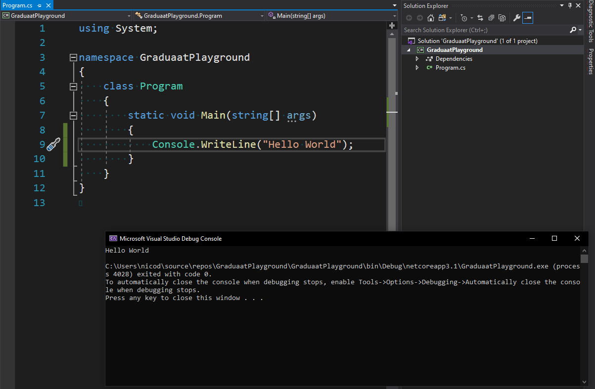
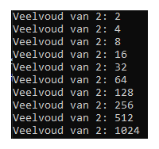
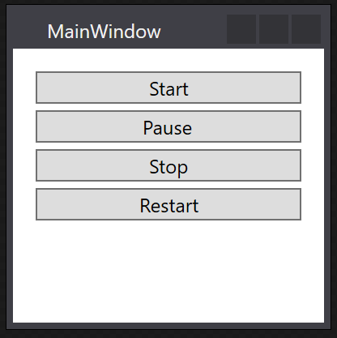

# <!-- fit --> Quick C# Refresh

Nico De Witte
bereikbaar via [nico.dewitte@vives.be](mailto:nico.dewitte@vives.be)

---

# Video

Bij deze slides hoort een video die je ook kan volgen. Je kan deze terug vinden op YouTube:

[https://youtu.be/DmNpo25QAv4](https://youtu.be/DmNpo25QAv4)

---

# Doel

Het doel van dit hoofdstuk is je C# kennis opfrissen en kijken waar je nog met vragen zit. Maak een lijstje van de dingen die je niet begrijpt en zoek ze op in het boek of stel er vragen over aan je docent.


---

# Applicaties in C#

We hebben onder andere volgende opties voor het maken van een C# applicatie:

* Console App: dit is een terminal applicatie die enkel met tekst via de terminal kan werken
* WPF App: applicatie met een grafische user interface

---

# Console Applicatie

Interactie gebeurt via de terminal met de app. Ziet er niet zo mooi uit maar wordt wel nog veel gebruikt om processen te automatiseren.

We werken hier hoofdzakelijk vanuit het standpunt van de `Main()` methode. Deze methode wordt uitgevoerd wanneer de app start.



---

# WPF Applicatie

Een WPF Applicatie is een moderne grafische applicatie. Kan er mits redelijk wat moeite in te stoppen heel mooi uitzien.


Een grafische applicatie is meestal ook event-gebaseerd (alles gebeurt op basis van events (gebeurtenissen)). Denk maar aan gebruiker die op een knop klikt.

---

# Variabels

Een symbolische naam voor een locatie in het geheugen die we in onze code kunnen gebruiken.

Variables dienen gedefinieerd te worden met volgende onderdelen:

* een type zoals `int`, `double`, `boolean`, `string`, ...
* een duidelijke naam
* een initiële waarde

```csharp
int numberOfStudents = 12;        // Geheel getal
string myName = "Nico De Witte";  // Text
double length = 1.83;             // Komma getal (floating point)
bool succeededExam = true;        // Boolean (true/false)
```

---

# Operaties

Op variabelen en waarden kunnen we wiskundige operaties uitvoeren.

| Operator | Beschrijving | Voorbeeld | Resultaat |
| :---: | :---: | :---: | :---: |
| `+` | Optellen | `int x = 7 + 3;` | `10` |
| `-` | Aftrekken | `int x = 3 - 7;` | `-4` |
| `*` | Vermenigvuldigen | `int x = 4 * 5;` | `20` |
| `/` | Geheel Delen | `int x = 9 / 2;` | `4` |
| `/` | Reëel Delen | `double x = 9.0 / 2;` | `4.5` |
| `%` | Rest bij Deling | `int x = 9 / 2;` | `1` |

---

# Strings

Tekst kan worden opgeslagen in een object van het type `string`. Strings hebben redelijk wat basisbewerkingen ter beschikking. Hieronder vind je de belangrijkste.

```csharp
string hello = "Hello";
string world = "World";

string helloWorld = hello + " " + world;      // Concatenatie (samenplakken strings)

// De lengte opvragen (aantal karakters)
int lengthHelloWorld = helloWorld.length;

// Omzetten van string naar getal (als er natuurlijk getal inzit)
string numberAsString = "42";   // Dit is tekst !!!
int number = Convert.ToInt32(numberAsString);       // 42 (getal)
```

---

# Console Output

Console output is natuurlijk hoofdzakelijk van belang wanneer je een C# Console App maakt maar zelfs in een WPF app kan je informatie naar de terminal printen. Dit kan soms helpen om een applicatie te debuggen.

Een paar voorbeelden:

```csharp
string myName = "Nico De Witte";

Console.WriteLine("Hello World van C#");          // String naar terminal printen
Console.WriteLine("Ik ben " + myName);            // Concatenatie (samenplakken strings)
Console.WriteLine("Ik ben " + 34 + " jaar oud");  // Concatenatie met int (wordt omgezet naar string)
```

---

# Vergelijkingsoperatoren

Laten ons toe waarden of variabelen met elkaar te vergelijken.

| Operator | Beschrijving | Voorbeeld | Resultaat |
| :---: | :---: | :---: | :---: |
| `==` | Gelijk aan | `bool result = (-5 == 5);` | `false` |
| `!=` | Verschillend van | `bool result = (8 != 5);` | `true` |
| `>` | Groter dan | `bool result = (3 > 5);` | `false` |
| `>=` | Groter dan of gelijk aan | `bool result = (5 >= 5);` | `true` |
| `<` | Kleiner dan | `bool result = (3 < 5);` | `true` |
| `<=` | Kleiner dan of gelijk aan | `bool result = (-5 <= 5);` | `true` |

---

# Beslissingsstructuren

Aan de hand van beslissingsstructuren kan code conditioneel worden uitgevoerd. De conditie van een beslissingsstructuur wordt meestal opgebouwd aan de hand van de vergelijkingsoperatoren.

* `if`: voer code uit als iets `true` (waar) is
* `if-else`: voer code uit als iets `true` is en in het andere geval voer je andere code uit
* `if-else if-else`: meerdere condities met bijhorende code-blokken

---

# If structuur

De `if` structuur laat ons toe code conditioneel uit te voeren. De code wordt uitgevoerd als de conditie `true` is.

```csharp
int age = 16;

if (age < 18) {
    Console.WriteLine("Sorry, nog geen alcohol voor jou.");
}
```

---

# If-else structuur

De `if-else` structuur voorziet een 2de codeblok die wordt uitgevoerd in geval de conditie `false` (onwaar) is.

```csharp
int age = 16;

if (age < 18) {
    Console.WriteLine("Sorry, nog geen alcohol voor jou.");
}
else {
    Console.WriteLine("Je mag alcohol drinken.");
}
```

---

# Meer conditionele blokken

Meerdere condities zijn mogelijk. Het bijhorende codeblok van de eerste die `true` is wordt uitgevoerd. De condities worden afgelopen van boven naar beneden.

```csharp
int age = 16;

if (age < 18) {
    Console.WriteLine("Sorry, nog geen alcohol voor jou.");
}
else if (age < 22) {
    Console.WriteLine("Je mag al eens een pintje drinken.");
}
else {
    Console.WriteLine("Geen limieten maar doe niet zot.");
}
```

---

# Herhalingsstructuren

Aan de hand van een herhalingsstructuur kunnen blokken code meerdere keren worden uitgevoerd. De herhaling gebeurt eveneens zoals bij de beslissingsstructuren op basis van een conditie.

* `for`: voer het code-blok een gekend aantal keer uit
* `while`: blijf het code-blok uitvoeren zolang de conditie waar is
* `do-while`: blijf het code-blok uitvoeren zolang de conditie waar is. Minimum 1x uitgevoerd.

---

# For loop

De `for` loop laat ons toe een code-block **een gekend aantal keer** uit te voeren. Bv. 10 keer of 1 keer voor elk element in een lijst

```csharp
for (int i = 0; i < 10; i++) {
    Console.WriteLine("i = " + i);
}
```

Lees als: Herhaal zolang de counter `i` kleiner is dan `10`. Met andere woorden `10x` itereren met `i=0` tot en met `i=9`. Stopt als `i=10` en de conditie `i < 10` `false` wordt.

---

# While loop

De `while` loop voert een code-block uit zolang de conditie `true` is. Deze wordt telkens gecheckt **voor de volgende iteratie**. Gevolg: kan zijn dat code-blok nooit wordt uitgevoerd als conditie van tevoren `false` is.



```csharp
int multiples = 1;
while (multiples < 1024)
{
    multiples = multiples * 2;
    Console.WriteLine("Veelvoud van 2: " + multiples);
}
```

---

# Do-While loop

De `while` loop voert een code-block uit zolang de conditie `true` is. Deze wordt telkens gecheckt **na de iteratie**. Gevolg: code-blok wordt altijd minstens 1x uitgevoerd.


```csharp
int deler = 1;
int getal = 247;
do
{
    deler = deler + 1;
} while (getal % deler != 0);
// Blijf loopen zolang getal
// niet deelbaar door deler

Console.WriteLine(getal + " is deelbaar door " + deler);
```

---

# Nesten van Structuren

Het is mogelijk om de beslissingsstructuren en herhalingstructuren in elkaar te nesten. Probeer hier echter niet in te overdrijven. Dit soort code ziet niemand graag komen:

```csharp
for (int i = 0; i < 100; i++) {
    if (i < 50) {
        if (i % 2 == 0) {
            // ...
            while (i < 50) {
                i += 3;
            }
        }
    }
    else {
        for (int x = i; x < 500; x++) {
            // ...
        }
    }
}
```

---

# Classes en Objecten

Objecten zijn instanties van classes. Bekijk een object als een huis dat wordt gebouwd op basis van een blauwdruk (de class).

Op het object kunnen we dan methode aanroepen. Dit zijn acties die we vragen van het object.

Een object heeft ook een bepaalde staat die we terug vinden in de vorm van interne variabelen.

---

# Objecten maken

Objecten maken doen we met het `new` keyword. We hebben daarnaast natuurlijk ook de naam van de class nodig en een variable om een referentie naar het object in te stoppen.

```csharp
Random generator = new Random();
```

`Random` is een class die toelaat willekeurige getallen te genereren. Bovenstaande code heeft nu een variable `generator` met referentie naar object die we kunnen vragen om getallen te genereren.

---

# Methodes aanroepen

Methodes aanroepen doen we meestal op een object.

Onderstaand toont een voorbeeld waar we 5 willekeurige getallen genereren door de `Next()` methode aan te roepen op het object dat we hebben gemaakt van de `Random` class.

```csharp
Random generator = new Random();

for (int i = 0; i < 5; i++) {
  Console.WriteLine("Random getal: " + generator.Next());
}
```


---

# Methodes aanroepen met Parameters

Dikwijls heeft een methode extra informatie nodig om zijn taak te kunnen uitvoeren. Dit kunnen we dan als parameters/argumenten meegeven aan de methode.

Zo kunnen we de `Next()` methode een maximumwaarde geven en dan zorgt deze er voor dat het willekeurig getal tussen `0` en dit maximum ligt.

```csharp
Random generator = new Random();

for (int i = 0; i < 5; i++) {
  Console.WriteLine("Random getal < 50: " + generator.Next(50));
}
```


---

# WPF

Windows Presentation Foundation (WPF) is een gratis en open-source subsysteem dat oorspronkelijk door Microsoft is ontwikkeld voor het renderen van grafische gebruikersinterfaces voor Windows applicaties.

We hebben hier enerzijds de grafische interface die gebouwd wordt in XAML en anderzijds de code logica in C# die we achter de grafische interface koppelen.

---

# XAML

XAML (eXtensible Application Markup Language), is de XML-variant van Microsoft voor het beschrijven van een GUI.

In eerdere GUI-frameworks, zoals WinForms, werd een GUI gemaakt in dezelfde taal die je zou gebruiken voor interactie met de GUI, bijv. C# of VB.NET en meestal onderhouden door de ontwerper (bijvoorbeeld Visual Studio).

Met XAML gaat Microsoft een andere kant op. Net als bij HTML kun je gemakkelijk je GUI schrijven en bewerken.

---

# TextBlock

Een `TextBlock` laat toe een blok tekst op de GUI te tonen. Dit is een visuele component.

```xml
<TextBlock Text="Welcome to Hello World in C# WPF"
  TextWrapping="Wrap" />
```


---

# Button

Een `Button` is een visuele en interactieve component. De klikactie van de gebruiker (event) kan worden gekoppeld met code die moet worden uitgevoerd (**event handler**).

```xml
<Button x:Name="sayHello" Content="Say Hello" Click="sayHello_Click" />
```

`Click` is hier het event en `sayHello_Click` is de event handler (methode) die wordt aangeroepen.


---

# TextBox

Een `TextBox` laat toe de gebruiker text in te geven als input aan de applicatie.

```xml
<TextBox x:Name="username" Text="Please enter your name ..." />
```


Belangrijk is dat we de component een naam geven `Name`, zodat we er later in code makkelijk aan kunnen.

---

# StackPanel

`StackPanel` is een niet-grafische container component. Het laat toe andere componenten te bundelen en bv. vertikaal onder elkaar te plaatsen.

```xml
<StackPanel Orientation="Vertical" Margin="12">
    <Button x:Name="start" Content="Start" Margin="2" />
    <Button x:Name="pause" Content="Pause" Margin="2" />
    <Button x:Name="stop" Content="Stop" Margin="2" />
    <Button x:Name="restart" Content="Restart" Margin="2" />
</StackPanel>
```



---

# StackPanel

Of horizontaal naast elkaar

```xml
<StackPanel Orientation="Horizontal" Margin="12">
    <Button x:Name="start" Content="Start" Margin="2" />
    <Button x:Name="pause" Content="Pause" Margin="2" />
    <Button x:Name="stop" Content="Stop" Margin="2" />
    <Button x:Name="restart" Content="Restart" Margin="2" />
</StackPanel>
```


