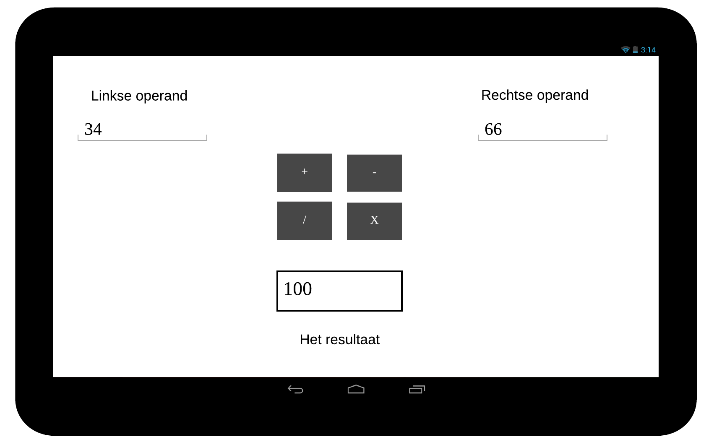
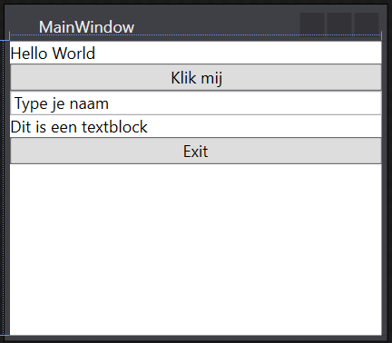
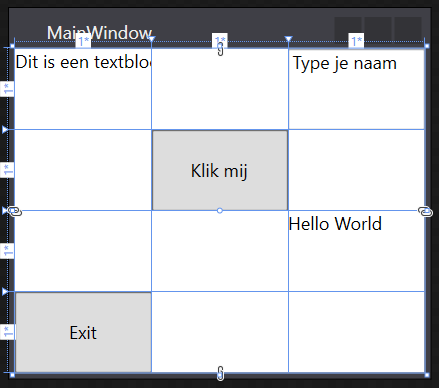
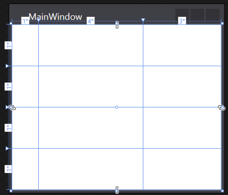
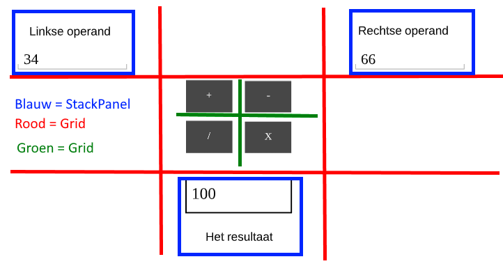
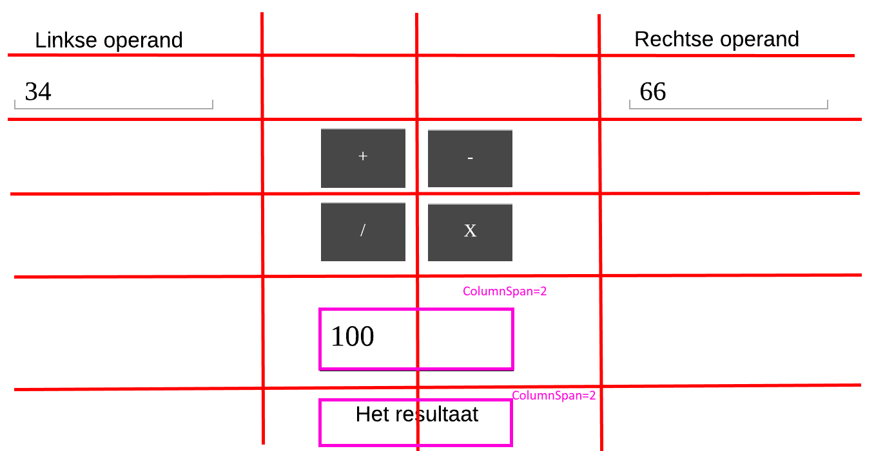

# <!-- fit --> A Basic Calculator

Nico De Witte
bereikbaar via [nico.dewitte@vives.be](mailto:nico.dewitte@vives.be)

---

# Videos

Bij deze slides horen twee video's die je ook kan volgen. Je kan deze terug vinden op YouTube:

* [A Basic Calculator in WPF - Part 1](https://youtu.be/RXm4F5oZV10)
* [A Basic Calculator in WPF - Part 2](https://youtu.be/WETb1nXWEBw)

---

# Doel

Het doel van dit hoofdstuk is basis GUI controls onder de hand krijgen. Hierbij wordt er gebruik gemaakt van container elementen voor het bekomen van een gestructureerde opbouw.


---

# Simpele Rekenmachine Bouwen

In dit hoofdstuk proberen we volgende grafische interface op te bouwen in WPF.



---

# Structuur in je GUI

Om structuur in je grafische elementen te stoppen kunnen we gebruik maken van container element.

Dit zijn elementen die op zich niet zichtbaar zijn. Ze zijn er enkel om andere componenten te bundelen.

Je kan ze nesten in elkaar om zo complexere interfaces te bouwen.

---

# Belangrijkste Container Elementen

Om structuur in je grafische elementen te stoppen kunnen we gebruik maken van volgende containers:

* een `StackPanel` laat toe componenten vertikaal of horizontaal na elkaar te plaatsen.
* een `Grid` laat toe componenten in rijen en kolommen te plaatsen.

Je kan 95% van de grafische interfaces structureren met deze 2 containers.

---

# StackPanel

Een `StackPanel` laat toe componenten vertikaal of horizontaal na elkaar te plaatsen door de `Orientation` op `Vertical` of `Horizontal` te zetten.

```xml
<StackPanel Orientation="Vertical">
  <TextBlock Text="Hello World" />
  <Button Content="Klik mij" />
  <TextBox Text="Type je naam" />
  <TextBlock Text="Dit is een textblock" />
  <Button Content="Exit" />
</StackPanel>
```



---

# Grid

Een `Grid` laat toe componenten in rijen en kolommen te plaatsen.

Het voorbeeld hier bestaat uit **3 kolommen** en **4 rijen**. Deze worden genummerd vanaf `0`.



---

# Rij- en kolomdefinities

Vooraleer je een `Grid` van cellen kan gebruiken dien je aan te geven hoeveel kolommen en rijen er dienen te zijn.

Dit kan je aan de van de sub-elementen `Grid.ColumnDefinitions` en `Grid.RowDefinitions`

```xml
<Grid>
  <Grid.ColumnDefinitions>
    <!-- ... -->
  </Grid.ColumnDefinitions>

  <Grid.RowDefinitions>
    <!-- ... -->
  </Grid.RowDefinitions>
</Grid>
```

Opgelet `<!-- ... -->` is drie puntjes `...` in commentaar.

---

# Kolomdefinitie

Het aantal kolommen kunnen we aangeven door in de elementen `Grid.ColumnDefinitions` een overeenkomstig aantal `ColumnDefinition` elementen te plaatsen.

```xml
<Grid>
  <Grid.ColumnDefinitions>
    <ColumnDefinition Width="*" />
    <ColumnDefinition Width="*" />
    <ColumnDefinition Width="*" />
  </Grid.ColumnDefinitions>
  <!-- ... -->
</Grid>
```

---

# Breedte van een kolom

Een kolom heeft als primaire eigenschap een *breedte* `Width`. Deze kan op verschillende manieren worden ingegeven:

* een waarde in pixels, bv. `<ColumnDefinition Width="12" />`
* het keyword `auto`, dan wordt deze zo breed als nodig om de sub-elementen erin te kunnen afbeelden, bv. `<ColumnDefinition Width="auto" />`
* verdeling van overblijvende ruimte aan de hand van de `*` syntax, bv. `<ColumnDefinition Width="*" />`
  * Je kan ook een zwaarder *gewicht* aan een kolom geven door een getal voor de `*` te plaatsen, bv. `<ColumnDefinition Width="3*" />`

---

# Breedte van een kolom

Wanneer kolommen in een `Grid` de `*` syntax gebruiken als breedte dan wordt de overblijvende ruimte verdeeld volgens het *gewicht*.

1. Eerst wordt het totaal aantal sterren bepaald

```xml
<Grid.ColumnDefinitions>
  <ColumnDefinition Width="1*" />
  <ColumnDefinition Width="4*" />
  <ColumnDefinition Width="3*" />
</Grid.ColumnDefinitions>
```

Hier is dit bv. `8`.

---

# Breedte van een kolom

2. Vervolgens wordt de breedte volgens het `gewicht` verdeeld.
    1. De eerste kolom krijgt `1/8`
    1. De tweede kolom krijgt `4/8` (de helft dus)
    1. De derde kolom krijgt `3/8`

```xml
<Grid.ColumnDefinitions>
  <ColumnDefinition Width="1*" />
  <ColumnDefinition Width="4*" />
  <ColumnDefinition Width="3*" />
</Grid.ColumnDefinitions>
```

---

# Resultaat



---

# Rijdefinitie

Het aantal rijen kunnen we aangeven door in de elementen `Grid.RowDefinitions` een overeenkomstig aantal `RowDefinition` elementen te plaatsen.

```xml
<Grid>
  <!-- ... -->
  <Grid.RowDefinitions>
    <RowDefinition Height="*" />
    <RowDefinition Height="*" />
    <RowDefinition Height="*" />
    <RowDefinition Height="*" />
  </Grid.RowDefinitions>
</Grid>
```

In tegenstelling tot een kolom, heeft een rij een *hoogte* of `Height`. Dezelfde regels gaan hier op als voor de breedte van een kolom.

---

# Elementen toekennen

Zodra je `Grid` is gedefinieerd, kan je elementen toekennen aan de cellen.

Dit doe je door elementen rechtstreeks in `Grid` te plaatsen en deze de eigenschappen `Grid.Row` en `Grid.Column` te geven. Hierbij kennen we deze de index toe van de kolom en rij (startend vanaf `0`).

```xml
<Grid>
  <!-- ... -->

  <TextBlock Grid.Row="2" Grid.Column="2" Text="Hello World" />
  <Button Grid.Row="1" Grid.Column="1" Content="Klik mij" />
  <TextBox Grid.Row="0" Grid.Column="2" Text="Type je naam" />
  <TextBlock Grid.Row="0" Grid.Column="0" Text="Dit is een textblock" />
  <Button Grid.Row="3" Grid.Column="0" Content="Exit" />
</Grid>
```

---

# Volledige Code van Grid

```xml
<Grid>
  <Grid.ColumnDefinitions>
    <ColumnDefinition Width="*" />
    <ColumnDefinition Width="*" />
    <ColumnDefinition Width="*" />
  </Grid.ColumnDefinitions>

  <Grid.RowDefinitions>
    <RowDefinition Height="*" />
    <RowDefinition Height="*" />
    <RowDefinition Height="*" />
    <RowDefinition Height="*" />
  </Grid.RowDefinitions>

  <TextBlock Grid.Row="0" Grid.Column="0" Text="Dit is een textblock" />
  <TextBox Grid.Row="0" Grid.Column="2" Text="Type je naam" />
  <Button Grid.Row="1" Grid.Column="1" Content="Klik mij" />
  <TextBlock Grid.Row="2" Grid.Column="2" Text="Hello World" />
  <Button Grid.Row="3" Grid.Column="0" Content="Exit" />
</Grid>
```

---

# Grid

Wat leidt tot het volgende resultaat.


---

# GUI op Papier

Een mooie grafische interface bouwen is moeilijk. Dat is eigenlijk meer het werk voor een designer. Dit betekent echter niet dat wij het ook niet kunnen proberen.

Beste aanpak is eigenlijk gewoon eerst je gedacht op papier zetten.

Om dan vervolgens een analyse te maken van de structuur.

---

# De papieren versie

Bekijk dit als de papieren versie. Dit werd gemaakt met een *Mockup* tool. Dat is een tool die hier speciaal voor dient. Snel een GUI in elkaar stoppen om als voorbeeld te gebruiken.

Deze werd gemaakt met [LucidChart](https://www.lucidchart.com/) maar er zijn er nog vele andere.


---

# Analyse

Dit is de moeilijkste stap. Hier dien je te bepalen welke componenten je gaat gebruiken en hoe je de structuur gaat opbouwen.

Dit doe ik meestal eveneens op papier of met een simpele tool zoals *Paint*.

Het moeilijke aan deze stap is dat je dikwijls meerdere oplossing hebt. Hier kies je dan best voor de minst complexe structuur.

---

# Analyse van de Calculator GUI



---

# Een andere optie

Een andere optie is ook het gebruiken van een vlakke structuur hier. Enkel een `Grid`.




---

# Een andere optie

Je dient dan wel het resultaat over 2 kolommen te splitsen met `ColumnSpan`. Dit laat toe meerdere kolommen te bundelen om elementen in te stoppen.

De tegenhanger voor een rij is `RowSpan`.

Dit werkt net zoals in een HTML tabel.

---

# Wat wordt het nu

Persoonlijk geef ik de voorkeur aan de eerste optie. Dit omdat dit de `TextBlock` en `TextBox` elementen die samenhoren bundelt in een `StackPanel`.

Dit maakt het makkelijker om ze eventueel later te verplaatsen.

Het geeft ook een logischere structuur aan de componenten.

---

# Implementatie

De eigenlijke implementatie vinden jullie terug in de YouTube video. Gelieve deze te volgen.

* [A Basic Calculator in WPF - Part 1](https://youtu.be/RXm4F5oZV10)
* [A Basic Calculator in WPF - Part 2](https://youtu.be/WETb1nXWEBw)

---

# Opdracht


Implementeer de 3 overige event handlers zodat de volledig rekenmachine werkt.

Experimenteer ook eens met de grafische layout en eigenschappen van de componenten (zie `View => Property Window`).
