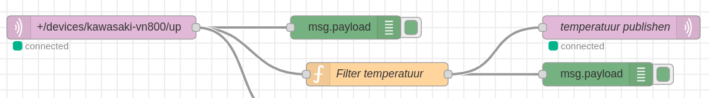
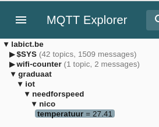

# <!-- fit --> Publishing to MQTT from NodeRED

Nico De Witte
bereikbaar via [nico.dewitte@vives.be](mailto:nico.dewitte@vives.be)

---

# Doel

Het doel van dit hoofdstuk is om data te publishen naar een MQTT broker vanuit NodeRED.

---

# MQTT Publish en Subscribe

Tot op heden hebben we enkel data ontvangen via MQTT. Data kan worden ontvangen nadat je op een bepaald **topic** hebt **gesubscribed** bij de **broker** (server).

*Herinner u de TTN waar we subscribeden op het topic van onze device om dan zo de data binnen te krijgen*.

We kunnen echter ook data versturen via MQTT. DIt proces heet het **publishen** van data.

---

---

# Van TTN naar onze broker

Wanneer we onze data vanuit The Things Network nu willen verwerken, kunnen we dit best via MQTT doen.

We hebben hiervoor twee mogelijkheden:

1. Rechtstreeks met de TTN communiceren vanuit C# via MQTT.
   1. Dit heeft als nadeel dat we de data opnieuw moeten filteren maar dan in C#
2. De data in NodeRED publishen naar onze eigen broker en dit in C# binnen nemen.

---

# Via onze eigen broker

De tweede aanpak heeft hier het voordeel dat we ook eens een **publish** kunnen testen vanuit NodeRED.

Als bijkomend voordeel hebben we ook dat we makkelijk data kunnen combineren, filteren of manipuleren vanuit NodeRED

---

# Een publish vanuit NodeRED

Om data te kunnen publishen in NodeRED hebben we nood aan een `mqtt out` node. Deze vind je terug onder `network`.

Plaats de node in de flow van je `Need for Speed` toepassing van de vorige keer (examenopdracht).

---

# Configureer de broker

Dit keer gaan we niet communiceren met de broker van TTN, maar met onze eigen broker (labict.be).

1. Kies om een nieuwe broker in te stellen - `Add new mqtt-broker...`
2. Stel volgende parameters in:
   1. Name: `LAB ICT Broker`
   2. Server: `labict.be`
   3. Username en password mag je leeg laten

---

# Het topic

Vervolgens dien je nu je eigen topic te kiezen. Dit zal bepalen waar de data terecht komt.

Bekijk dit als een chat-kanaal. Iedereen die in hetzelfde kanaal zit kan meeluisteren. Zit je er niet in dan zie je niets.

Kies een topic dat start met `graduaat/iot/needforspeed/` en plaats hierachter bijvoorbeeld `jenaam/temperatuur`.

Vb.: `graduaat/iot/needforspeed/nico/temperatuur`

---

# Het topic

Zoals je misschien doorhebt, kan je structuur in de topics stoppen.

Je kan de configuratie van de node nu opslaan.

---

# Koppelen aan de batterij temperatuur

Koppel nu de batterij temperatuur van de *Need for Speed* flow aan de `mqtt out` node zodat de temperatuur wordt gepublished.

Vergeet natuurlijk niet op `Deploy` te klikken als je klaar bent.

---

# MQTT Explorer

Dit moeten we natuurlijk wel even testen.

Een leuke en gebruiksvriendelijke app is MQTT Explorer die je hier kan downloaden: [http://mqtt-explorer.com/](http://mqtt-explorer.com/).

---

# Configuratie Broker

Zodra je de App opstart vraagt deze om de broker te configureren.

Kies dezelfde opties als je net in NodeRED deed:

* Host: `labict.be`
* Geen wachtwoord of username

**Belangrijk**: Vink `Validate certificate` uit.

Klik op `Save` en vervolgens op `Connect`.

---

---

# Zie de data binnenstromen

Als alles goed is zou je na een tijdje (maximum 30 seconden) de temperatuur moeten zien verschijnen onder jouw topic.

Het leuke aan deze tool is dat die alle topics toont waar data op binnen komt.

---

# Batterij Percentage

Doe nu hetzelfde voor het batterij percentage.

Je hebt hiervoor een nieuwe `mqtt out` node nodig. Neem de bestaande `labict.be` broker. Je hebt echter wel nieuw topic nodig !

Vb.: `graduaat/iot/needforspeed/nico/percentage`

Pas dit natuurlijk aan naar jouw naam.

Deploy de flow en kijk in MQTT Explorer of de data binnen komt.

---

# Publishen van Batterij Percentage

---

# Ontvangen van Batterij Percentage

Als alles goed gaat zou je nu ook je percentage moeten binnen krijgen in de MQTT Explorer app.

---

# Overzicht

Onze huidige setup ziet voorlopig als volgt uit

