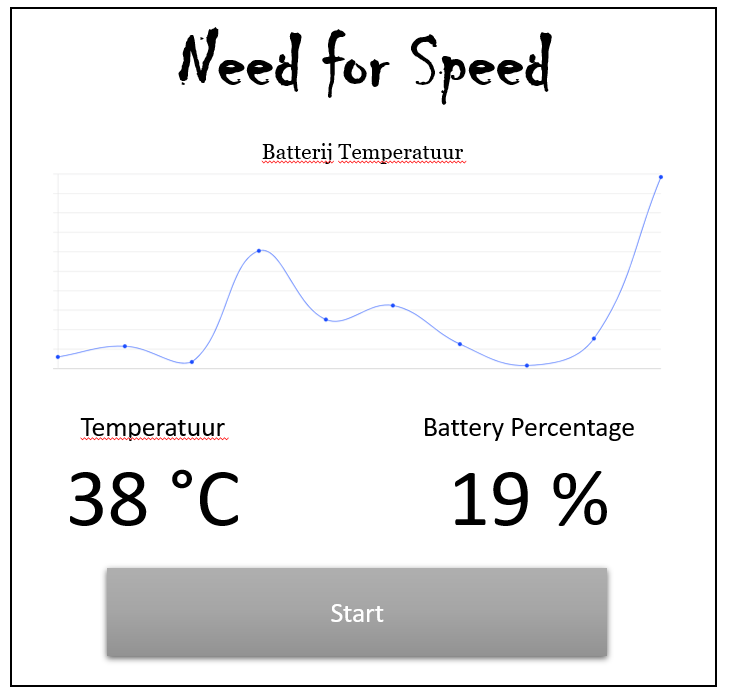

# <!-- fit --> MQTT with C#

Nico De Witte
bereikbaar via [nico.dewitte@vives.be](mailto:nico.dewitte@vives.be)

---

# Doel

Leren werken met MQTT vanuit C#.


---

# Sketch van de GUI

Een simpele sketch van de UI die we gaan bouwen.



---

# Structuur UI

Dit kunnen we redelijk makkelijk realiseren met een `Grid` en wat `StackPanel` containers.

Daarbij hebben we ook het voordeel dat we makkelijk dingen kunnen bijvoegen.


---

# Nieuwe WPF App

Start met het maken van een nieuwe **WPF App (.NET Framework)** en noem deze bv. `NeedForSpeed`.


---

# Kleuren palette

Als je inspiratie nodig hebt voor een kleurencombinatie dan is een site zoals [https://coolors.co/](https://coolors.co/) heel handig.

Dit soort generatoren probeert kleuren te genereren die een beetje bij elkaar passen.

Mijn voorbeeld:


---

# Voorbeeld

Dit is een voorbeeld ter illustratie. Probeer eerst zelf iets te maken en als het niet lukt start dan van de code in volgende slide.


---

# Code Voorbeeld

```xml
<Window x:Class="NeedForSpeed.MainWindow"
        xmlns="http://schemas.microsoft.com/winfx/2006/xaml/presentation"
        xmlns:x="http://schemas.microsoft.com/winfx/2006/xaml"
        xmlns:d="http://schemas.microsoft.com/expression/blend/2008"
        xmlns:mc="http://schemas.openxmlformats.org/markup-compatibility/2006"
        xmlns:local="clr-namespace:NeedForSpeed"
        mc:Ignorable="d"
        Title="MainWindow" Height="600" Width="800" Background="#F7FFF7">
    <Grid>
        <Grid.ColumnDefinitions>
            <ColumnDefinition Width="*" />
            <ColumnDefinition Width="*" />
        </Grid.ColumnDefinitions>

        <Grid.RowDefinitions>
            <RowDefinition Height="auto" />
            <RowDefinition Height="*" />
            <RowDefinition Height="auto" />
            <RowDefinition Height="auto" />
        </Grid.RowDefinitions>
```

---

# Code Voorbeeld (vervolg)

```xml
        <TextBlock Grid.Row="0" Grid.Column="0" Grid.ColumnSpan="2"
                   Text="Need for Speed" TextAlignment="Center"
                   FontSize="48" Margin="22"
                   FontFamily="Ravie"
                   Foreground="#FFE66D" Background="#292F36"
                   />

        <StackPanel Grid.Row="1" Grid.Column="0" Grid.ColumnSpan="2"
                    Orientation="Vertical">

            <TextBlock Text="Temperatuur Batterij"
                       FontSize="22"
                       TextAlignment="Center"
                       />

            <TextBlock Text="## Hier komt een grafiek ##"
                       FontSize="12"
                       TextAlignment="Center"
                       />
        </StackPanel>
```

---

# Code Voorbeeld (vervolg)

```xml

        <StackPanel Grid.Row="2" Grid.Column="0" Margin="12"
                    Orientation="Vertical">

            <TextBlock Text="Temperatuur" TextAlignment="Center" FontSize="22" />
            <TextBlock Text="38 °C" TextAlignment="Center" FontSize="64" />
        </StackPanel>

        <StackPanel Grid.Row="2" Grid.Column="1" Margin="12"
                    Orientation="Vertical">

            <TextBlock Text="Percentage" TextAlignment="Center" FontSize="22" />
            <TextBlock Text="19 %" TextAlignment="Center" FontSize="64" />
        </StackPanel>

        <Button Grid.Row="3" Grid.Column="0" Grid.ColumnSpan="2"
                Content="Start Data Ontvangst"
                Padding="6" Margin="24"
                FontSize="16"
                Background="#292F36" Foreground="#F7FFF7"/>
    </Grid>
</Window>
```

---

# Event Handler Start Knop

De start knop zal de data ontvangst in gang zetten. We hebben hiervoor dus een event handler nodig.

Herinner u:

* Geef de knop eerst een naam in XAML: `<Button x:Name="Start" ... >`
* Creëer vervolgens een event handler: `<Button x:Name="Start" Click="Start_Click" ...>`

---

# Testen Start Knop

Ga nu naar de code behind file `MainWindow.cs` en print een bericht naar de console als er op de knop wordt gedrukt:

```csharp
private void Start_Click(object sender, RoutedEventArgs e)
{
    Console.WriteLine("Er werd op start geklikt");
}
```

---


<!-- https://www.hivemq.com/blog/mqtt-client-library-encyclopedia-m2mqtt/ -->