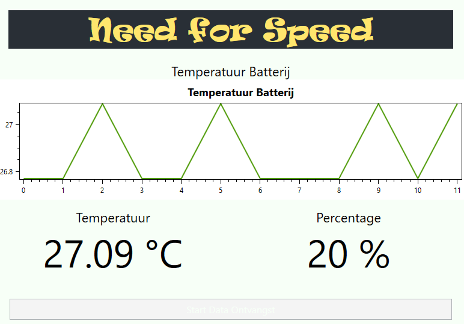

# <!-- fit --> MQTT with C#

Nico De Witte
bereikbaar via [nico.dewitte@vives.be](mailto:nico.dewitte@vives.be)

---

# Videos

Bij deze slides horen twee video's die je ook kan volgen. Je kan deze terug vinden op YouTube:

* [MQTT from C# - Part 1](https://youtu.be/6vWoMiRH_nE)
* [MQTT from C# - Part 2](https://youtu.be/uFoyM1bzJts)

---

# Doel

Leren werken met MQTT vanuit C#.


---

# Sketch van de GUI

Een simpele sketch van de UI die we gaan bouwen.


---

# Structuur UI

Dit kunnen we redelijk makkelijk realiseren met een `Grid` en wat `StackPanel` containers.

Daarbij hebben we ook het voordeel dat we makkelijk dingen kunnen bijvoegen.


---

# Nieuwe WPF App

Start met het maken van een nieuwe **WPF App (.NET Framework)** en noem deze bv. `NeedForSpeed`.


---

# Kleuren palette

Als je inspiratie nodig hebt voor een kleurencombinatie dan is een site zoals [https://coolors.co/](https://coolors.co/) heel handig.

Dit soort generatoren probeert kleuren te genereren die een beetje bij elkaar passen.

Mijn voorbeeld:


---

# Voorbeeld

Dit is een voorbeeld ter illustratie. Probeer eerst zelf iets te maken en als het niet lukt start dan van de code in volgende slide.


---

# Code Voorbeeld

Als het niet lukt om de GUI op te bouwen kan je ook vertrekken van mijn code. Deze vind je hier terug: [https://github.com/BioBoost/graduaat-iot-slide-deck/blob/master/code/12-mqtt-with-csharp/csharp-simple-mqtt-client/MainWindow.xaml](https://github.com/BioBoost/graduaat-iot-slide-deck/blob/master/code/12-mqtt-with-csharp/csharp-simple-mqtt-client/MainWindow.xaml).

---

# Event Handler Start Knop

De start knop zal de data ontvangst in gang zetten. We hebben hiervoor dus een event handler nodig.

Herinner u:

* Geef de knop eerst een naam in XAML: `<Button x:Name="Start" ... >`
* Creëer vervolgens een event handler: `<Button x:Name="Start" Click="Start_Click" ...>`

---

# Testen Start Knop

Ga nu naar de code behind file `MainWindow.cs` en print een bericht naar de console als er op de knop wordt gedrukt:

```csharp
private void Start_Click(object sender, RoutedEventArgs e)
{
    Console.WriteLine("Er werd op start geklikt");
}
```

Test dit eens grondig.

---

# Library voor MQTT

Vooraleer we aan de slag kunnen met MQTT dienen we een library te hebben die de communicatie via MQTT verzorgt.

We kunnen hiervoor best gebruik maken van `M2Mqtt` (Machine to MQTT).

Libraries installeren in Visual Studio is heel eenvoudig via de NuGet Package Manager.

---

# Zoeken van M2Mqtt Package

Navigeer naar het menu `Project` en selecteer `Manage NuGet Packages...`.

Selecteer het tabblad `Browse` en zoek naar `M2Mqtt`.

Selecteer vervolgens de entry `M2Mqtt by Paolo Patierno`.


---

# Installeren van M2Mqtt Package

Je krijgt nu een venster met de optie om de package te installeren.

Click op de `Install` knop en wacht even tot dit klaar is.


Nu kunnen we aan de slag met MQTT.

Sluit de package manager.

---

# Starten van Tutorial

Om te starten met deze library ben ik vertrokken van volgende tutorial: [https://www.hivemq.com/blog/mqtt-client-library-encyclopedia-m2mqtt/](https://www.hivemq.com/blog/mqtt-client-library-encyclopedia-m2mqtt/).

Je kan deze gerust ook eens bekijken voor meer informatie maar wij gaan een licht andere aanpak hanteren.

---

# Stap 1 - Simple MQTT Client

Als eerste stap mag je een nieuwe class maken in het project en deze `SimpleMqttClient.cs` noemen. Opgelet met de hoofdletters.

Klik hiervoor rechts op het NeedForSpeed project en selecteer `Add => Class`.


---

# Stap 1 - Connectie met Broker

Vooraleer we berichten kunnen ontvangen via MQTT dienen we connectie te maken met de broker. Dit proces kunnen we starten vanuit de handler van de `Start` knop.

We hebben hiervoor echter een aantal dingen nodig

* de host naam van de broker, in ons geval is dit `labict.be`
* een object van de class `MqttClient` waar we de `Connect()` methode dan kunnen op aanroepen
* een client id, een unieke identificatie voor de client vanuit onze C# app nodig tijdens het maken van de connectie

---

# Stap 1 - Connectie met Broker (vervolg)

Laat ons starten met het maken van een `MqttClient` object. Hiervoor hebben we tevens de host naam nodig van de broker, `labict.be`.

Laat ons beginnen met volgende code snippet voor de `Start_Click` handler:

```csharp
private void Start_Click(object sender, RoutedEventArgs e)
{
    Console.WriteLine("Connectie maken met de broker");

    // String variabel met host naam van de broker
    string host = "labict.be";

    // Nieuw MqttClient object maken
    MqttClient client = new MqttClient(host);
}
```

---

# Stap 1 - Connectie met Broker (vervolg)

Er is hier echter 1 klein probleem met deze code. De variabel `client` is lokaal aan de methode. Dat betekent als de methode uitgevoerd is dat deze verdwijnt en dus ook onze connectie.

Daarom moeten we de variabel als **attribuut** van het `MainWindow` declareren door hem bovenaan te zetten.

Vergeet dan echter niet van de declaratie in de start knop handler weg te doen.

---

# Stap 1 - Connectie met Broker (vervolg)

Dus


---

# Stap 1 - Connectie met Broker (vervolg)

Eindresultaat

```csharp
public partial class MainWindow : Window
{
    // Attributen
    MqttClient client;          // MqttClient object

    // ...

    private void Start_Click(object sender, RoutedEventArgs e)
    {
        Console.WriteLine("Connectie maken met de broker");

        // String variabel met host naam van de broker
        string host = "labict.be";

        // Nieuw MqttClient object maken en opslaan in attribuut
        client = new MqttClient(host);
    }
}
```

---

# Stap 1 - Connectie met Broker (vervolg)

Nu hebben we een `MqttClient` object ter beschikking waaraan we kunnen vragen om een connectie te initiëren met de broker door de `Connect()` methode aan te roepen.

De `Connect()` methode heeft echter wel een extra gegeven nodig, en dat is een uniek client id.

```csharp
private void Start_Click(object sender, RoutedEventArgs e)
{
    // ...

    // Nieuw MqttClient object maken en opslaan in attribuut
    client = new MqttClient(host);

    // Een uniek id voor onze mqtt client
    string clientId = "nico123789";

    // Roep de Connect methode aan om de connectie met de broker op te zetten
    client.Connect(clientId);
}
```

---

# Stap 2 - Controle

Na het starten van de connectie kunnen we best een kleine controle uitvoeren om te kijken of alles gelukt is. Dit kunnen we doen door aan het `client` object te vragen of de verbinding met de broker is gemaakt.

```csharp
private void Start_Click(object sender, RoutedEventArgs e)
{
    // ...

    client.Connect(clientId);

    if (client.IsConnected)     // Controleer of we verbonden zijn met broker
    {
        Console.WriteLine("Connectie met broker in orde");
        Start.IsEnabled = false;        // Start knop uitschakelen
    }
    else
    {
        Console.WriteLine("Er is iets misgelopen bij connectie met broker");
    }
}
```

---

# Step 3 - Connectie verbreken

Wanneer de gebruiker de app afsluit dienen we ook mooi de connectie te verbreken met de broker. Doen we dit niet, gaan we na een tijdje geen connecties meer kunnen maken.

Het beste dat we kunnen doen is een event handler koppelen aan het `Closing` event van het `Window` zelf. Dit is vergelijkbaar met het `Click` event van een `Button`.

Voeg de handler toe aan het `Window` bovenaan in XAML:


---

# Step 3 - Connectie verbreken (vervolg)

Ga nu naar de code behind en plaats onderstaande code in de `Window_Closing` event handler:

```csharp
private void Window_Closing(object sender, System.ComponentModel.CancelEventArgs e)
{
    Console.WriteLine("Verbreken van verbinding met broker");

    // Verbreek de verbinding met de broker
    client.Disconnect();
}
```

Om de connectie te verbreken dienen we enkel de `Disconnect()` methode aan te roepen op het `MqttClient` object.

---

# Step 4 - Eens Testen

Als je de applicatie nu start zou je een succesvolle connectie moeten krijgen wanneer je op de start knop drukt.

---

# Step 5 - Publishen van een status bericht

Als tweede test kunnen we ook proberen om een bericht te publishen op een topic. Dit kunnen we bijvoorbeeld doen in het `if` statement als de connectie gelukt is.

```csharp
if (client.IsConnected)     // Controleer of we verbonden zijn met broker
{
    Console.WriteLine("Connectie met broker in orde");
    Start.IsEnabled = false;        // Start knop uitschakelen

    // Publish een hallo bericht als test/notificatie
    client.Publish("graduaat/iot/needforspeed/nico/status",
        Encoding.UTF8.GetBytes("Connectie vanuit C#"));
}
// ...
```

Merk op dat we de string `Connectie vanuit C#` dienen om te zetten naar een array van bytes zoals hierboven getoond.

---

# Step 6 - Eens Testen

Als we nu MQTT Explorer open zetten en dan op de start knop drukken in onze app zouden we het bericht moeten zien passeren.


---

# Step 7 - Subscriben

Om berichten binnen te krijgen in onze C# app dienen we te **subscriben** op de correcte topics, namelijk deze waarop we vanuit NodeRED publishen.

Hiervoor hebben we opnieuw een handler methode nodig die reageert op het ontvangen van een bericht via de `MqttClient`. Je kan dit opnieuw vergelijken met het drukken op een knop, maar dit keer is het event het ontvangen van een bericht.

---

# Step 7 - Subscriben (vervolg)

De handler ziet er als volgt uit:

```csharp
private void MqttMessageReceived(object sender, MqttMsgPublishEventArgs e)
{
  // ...
}
```

---

# Step 7 - Subscriben (vervolg)

Laat ons eerst beginnen met het ontvangen bericht naar de terminal te printen:

```csharp
private void MqttMessageReceived(object sender, MqttMsgPublishEventArgs e)
{
    // Omgekeerde bewerking: bytes omzetten naar een string
    string bericht = Encoding.UTF8.GetString(e.Message);
    string topic = e.Topic;

    // Uitschrijven naar de console
    Console.WriteLine("Er werd een bericht ontvangen via MQTT:");
    Console.WriteLine(bericht);
    Console.WriteLine("Op het topic: " + topic);
}
```

Merk op dat we hier de omgekeerde bewerking moeten doen bij het ontvangen van het bericht, namelijk een array van bytes omzetten naar een string.

---

# Step 7 - Subscriben (vervolg)

Nu dienen we nog 2 acties te ondernemen:

* subscriben op de nodige topics
* onze handler registreren zodat de berichten juist terecht komen

---

# Step 7 - Subscriben (vervolg)

Het leuke met MQTT is dat je kan subscriben op meerdere topics door gebruik te maken van wildcards zoals `#`. Dit zorgt er voor dat je alle berichten van een bepaald topic en al zijn subtopics krijgt.

Bv. subscriben op `graduaat/iot/needforspeed/nico/#` laat toe om eveneens berichten te krijgen op `graduaat/iot/needforspeed/nico/temperatuur` of `graduaat/iot/needforspeed/nico/battery/health`.

Je kan hier meer informatie omtrent vinden op deze site: [https://www.hivemq.com/blog/mqtt-essentials-part-5-mqtt-topics-best-practices/](https://www.hivemq.com/blog/mqtt-essentials-part-5-mqtt-topics-best-practices/)

---

# Step 7 - Subscriben (vervolg)

Subscriben op topics doen we opnieuw in de `Start_Click` handler. We kunnen de code hiervoor in de `if` statement plaatsen na de publish.

```csharp
if (client.IsConnected)     // Controleer of we verbonden zijn met broker
{
    // ...

    // Publish een hallo bericht als test/notificatie
    client.Publish("graduaat/iot/needforspeed/nico",
        Encoding.UTF8.GetBytes("Connectie vanuit C#"));

    // Subscriben op ons volledig topic
    client.Subscribe(   new string[] { "graduaat/iot/needforspeed/nico/#" },
                        new byte[] { MqttMsgBase.QOS_LEVEL_EXACTLY_ONCE });
}
```

---

# Step 7 - Subscriben (vervolg)

De code voor de subscribe actie is iets complexer omdat je eigenlijk een lijst van topics moet doorgeven, ook al heb je er maar 1.

Daarbij moet je een lijst van Quality of Service levels meegeven (hoe dikwijls bericht ontvangen dient te worden). Meer info over de QoS levels vind je hier [https://www.hivemq.com/blog/mqtt-essentials-part-6-mqtt-quality-of-service-levels/](https://www.hivemq.com/blog/mqtt-essentials-part-6-mqtt-quality-of-service-levels/).

---

# Step 7 - Subscriben (vervolg)

Vervolgens dienen we ook onze handler (methode) te registreren bij de MqttClient zodat deze weet welke methode hij dient aan te roepen als er een bericht binnen komt.

Dit doen we net na de subscribe actie.

```csharp
if (client.IsConnected)     // Controleer of we verbonden zijn met broker
{
    // ...

    // Subscriben op ons volledig topic
    client.Subscribe(   new string[] { "graduaat/iot/needforspeed/nico/#" },
                        new byte[] { MqttMsgBase.QOS_LEVEL_EXACTLY_ONCE });

    // Registreren van de handler die de berichten ontvangt
    client.MqttMsgPublishReceived += MqttMessageReceived;
}
```

Waarom staat er nu een `+=` om de handler te registreren? Wel eigenlijk houdt de MqttClient een lijst van handlers bij en wij voegen er eentje aan toe.

---

# Step 8 - Testen

Normaal als je nu op de start knopt drukt en je NodeRED flow is actief zou je de temperatuur en het percentage moeten zien binnenkomen in de console.


Moest je het output venster niet hebben, kan je dit activeren via `View => Output`.

---

# Step 9 - Afbeelden Data

Ons volgend doel is het afbeelden van de waarden op de GUI.

Vooraleer we verder kunnen dienen we de TextBlock componenten wel een degelijke naam te geven, anders kunnen we in onze code er niet aan.

Dus

```xml
<TextBlock x:Name="Temperatuur" Text="? °C" TextAlignment="Center" FontSize="64" />
<!--en-->
<TextBlock x:Name="Percentage" Text="? %" TextAlignment="Center" FontSize="64" />
```

---

# Step 9 - Afbeelden Data (vervolg)

We krijgen dus volgende informatie binnen:

```text
Er werd een bericht ontvangen via MQTT:
21
Op het topic: graduaat/iot/needforspeed/nico/percentage
Er werd een bericht ontvangen via MQTT:
27.41
```

Het probleem hier is dat deze informatie niet samen binnenkomt. De handler werd hiervoor 2x aangeroepen. 1x voor de temperatuur en 1x voor het percentage. We moeten nu echter weten welke data er toekomt om het te kunnen afbeelden.

---

# Step 9 - Afbeelden Data (vervolg)

De data filteren kunnen we realiseren aan de hand van de topics. In de handler krijgen we naast de data ook op welk topic de data werd ontvangen. We kunnen op basis hiervan dus bepalen welke data het net is dat we binnen krijgen.

---

# Step 9 - Afbeelden Data (vervolg)

```csharp
private void MqttMessageReceived(object sender, MqttMsgPublishEventArgs e)
{
    // Omgekeerde bewerking: bytes omzetten naar een string
    string bericht = Encoding.UTF8.GetString(e.Message);
    string topic = e.Topic;

    // ...

    if (e.Topic == "graduaat/iot/needforspeed/nico/temperatuur")
    {
        Console.WriteLine("De temperatuur is " + bericht);
    }
    else if (e.Topic == "graduaat/iot/needforspeed/nico/percentage")
    {
        Console.WriteLine("Het batterij percentage is " + bericht);
    }
}
```

---

# Step 9 - Afbeelden Data (vervolg)

Nu is het maar een kleine stap meer om de TextBlock's aan te passen:

```csharp
private void MqttMessageReceived(object sender, MqttMsgPublishEventArgs e)
{
    // Omgekeerde bewerking: bytes omzetten naar een string
    string bericht = Encoding.UTF8.GetString(e.Message);
    string topic = e.Topic;

    // ...

    if (e.Topic == "graduaat/iot/needforspeed/nico/temperatuur")
    {
        Console.WriteLine("De temperatuur is " + bericht);
    }
    else if (e.Topic == "graduaat/iot/needforspeed/nico/percentage")
    {
        Console.WriteLine("Het batterij percentage is " + bericht);
    }
}
```

---

# Step 10 - Testen

Als je dit nu test dan zal je merken dat de applicatie faalt op het moment dat de data binnen komt.


Het kan altijd allemaal direct goed lopen.

---

# Step 10 - Testen (vervolg)

Het achterliggend probleem is vrij complex maar het komt er eigenlijk op naar dat het updaten van de GUI een apart proces is in je C# app. Dit zorgt er voor dat netwerk-communicatie, files lezen en schrijven, ... de GUI niet kunnen laten vastlopen terwijl ze hun verwerking doen.

Het nadeel hiervan is dat je vanuit zo een netwerk-process (wat MqttClient is) niet zomaar de GUI kan aanpassen. Je moet als het ware aan het GUI process vragen, als je straks tijd hebt, kan je dan de TextBlock updaten.

---

# Step 10 - Testen (vervolg)

Het uitgesteld updaten van de GUI doe je aan de hand van volgende code-constructie:

```csharp
if (e.Topic == "graduaat/iot/needforspeed/nico/temperatuur")
{
    Console.WriteLine("De temperatuur is " + bericht);

    // Update de GUI
    Dispatcher.Invoke(delegate
    {
        Temperatuur.Text = bericht + " °C";
    });
}
// ...
```

---

# Step 10 - Testen (vervolg)

En dezelfde constructie dient ook binnen de `else if` clausule te komen:

```csharp
// ...
else if (e.Topic == "graduaat/iot/needforspeed/nico/percentage")
{
    Console.WriteLine("Het batterij percentage is " + bericht);

    // Update de GUI
    Dispatcher.Invoke(delegate
    {
        Percentage.Text = bericht + " %";
    });
}
```

---

# Een Grafiek Tonen

Als laatste zou het zeer leuk zijn moesten we nog een kleine grafiek kunnen toevoegen.

Het nadeel is dat dit soms vrij complex is.

Daarom heb ik een zeer gebruiksvriendelijk library proberen zoeken die dit toch verteerbaar maakt.

---

# OxyPlot

OxyPlot is daarbij naar voor gekomen die toch toegankelijk is en ook vooral gratis (veel betalende libraries voor dit soort dingen).

Je kan de library opnieuw installeren als NuGet Package. Dus `Project => Manage NuGet Packages...`

Vervolgens het tabblad `Browse` selecteren en zoeken op `OxyPlot`.

---

# OxyPlot

En vervolgens is het de `OxyPlot.Wpf` package die je dient te installeren.


Meer informatie en tutorials zijn hier te vinden: [https://oxyplot.readthedocs.io/en/latest/getting-started/hello-wpf.html](https://oxyplot.readthedocs.io/en/latest/getting-started/hello-wpf.html)

---

# Stap 1 - Library koppelen in XAML

Vooraleer we grafische componenten uit libraries in XAML kunnen gebruiken dienen we eerst hun namespace te importeren in XAML. Volgende lijn dien je helemaal bovenaan in je `MainWindow.xaml` toe te voegen bij de rest van de namespaces:

```xml
xmlns:oxy="http://oxyplot.org/wpf"
```

Een namespace is als een soort container met classes, componenten en andere dingen erin. Namespaces zorgen er vooral voor dat componenten van verschillende libraries eenzelfde naam kunnen hebben en toch geen conflicten geven.

---

# Stap 1 - Library koppelen in XAML (vervolg)

Dit zou moeten resulteren in


---

# Stap 2 - Toevoegen van een grafiek

Vervolgens dienen we de grafische component `oxy:PlotView` ook toe te voegen in onze XAML structuur.

Dit kan als volgt:

```xml
<TextBlock Text="Temperatuur Batterij"
            FontSize="22"
            TextAlignment="Center"
            />

<oxy:PlotView x:Name="TemperatuurPlot" Model="{Binding TemperatureDataModel}" Height="200" />
```

Hierbij is `TemperatureDataModel` een naam die we zelf kiezen die onze data beschrijft. Op basis hiervan gaan we de eigenlijke data koppelen (binden) aan de grafiek (de grafische component dan).

---

# Stap 3 - Definieren Data Model

De volgende stap bestaat uit het definieren van de property voor het datamodel. Dit kan je aanzien als een beschikbare eigenschap langs waar de GUI component aan de data kan.

Je dient dit bovenaan de class te zetten (buiten de methodes maar binnen in de class). Bv. onder het `MqttClient` attribuut.

```csharp
public partial class MainWindow : Window
{
    // Attributen
    MqttClient client;          // MqttClient object

    // Data koppeling met grafiek
    public PlotModel TemperatureDataModel { get; private set; }

    // ...
```

---

# Stap 4 - Creeren van het Data Model

Vooraleer we kunnen starten met toevoegen van data punten aan het data model dienen we enkel nog een object te maken van het datamodel. Dit doen we best in de constructor methode van `MainWindow` (de methode met dezelfde naam).

```csharp
public MainWindow()
{
    InitializeComponent();

    // Creeer nieuw data model object
    TemperatureDataModel = new PlotModel { Title = "Temperatuur Batterij" };
    this.DataContext = this;        // Activeer de koppeling (binding) met de GUI
}
```

---

# Stap 5 - Lijst van temperaturen

Nu dienen we nog aan het data model een `LineSeries` toe te voegen. Hiermee geven we aan hoe we wensen dat onze data punten worden afgebeeld. Zo heb je ook een `PieSeries`, `HistogramSeries`, ... allemaal verschillende types grafieken.

---

# Stap 5 - Lijst van temperaturen (vervolg)

Omdat we later hier nog data moeten aan toevoegen dienen we deze `LineSeries` in een attribuut bovenaan te plaatsen.

```csharp
public partial class MainWindow : Window
{
    // ...
    // Data koppeling met grafiek
    public PlotModel TemperatureDataModel { get; private set; }

    // Een serie van datapunten voor de temperatuur
    LineSeries temperatuurSeries = new LineSeries();

    // ...
```

---

# Stap 5 - Lijst van temperaturen (vervolg)

En dan moet de lijst worden toegevoegd aan de grafiek. Dit doen we opnieuw in de constructor `MainWindow`:

```csharp
public MainWindow()
{
    InitializeComponent();

    // Creeer nieuw data model object
    TemperatureDataModel = new PlotModel { Title = "Temperatuur Batterij" };
    this.DataContext = this;        // Activeer de koppeling (binding) met de GUI

    // Serie van temperaturen toevoegen aan grafiek
    TemperatureDataModel.Series.Add(temperatuurSeries);
}
```

Dit betekent dat je dus in principe meerdere `LineSeries` in eenzelfde grafiek kan tonen. Je zou bijvoorbeeld ook de buitentemperatuur kunnen tonen.

---

# Stap 6 - Toevoegen van Data

De allerlaatste stap bestaat uit het toevoegen van de temperatuur aan de series afkomstig van MQTT. Dit is waarschijnlijk de meest begrijpbare stap van dit hele gebeuren.

Dit dient te gebeuren in de MQTT handler waar de berichten toe komen.

---

# Stap 

Dit dient in de `if` statement te komen voor de temperatuur:

```csharp
// Update de GUI
Dispatcher.Invoke(delegate
{
    Temperatuur.Text = bericht + " °C";

    // Onze x-waarde is gewoon het aantal waarden dat er reeds aanwezig zijn
    int x = temperatuurSeries.Points.Count;

    // Omzetten van string naar double
    double temperatuur = Convert.ToDouble(bericht);

    // Toevoegen aan de temperuur series
    temperatuurSeries.Points.Add(new DataPoint(x, temperatuur));

    // Zorg er voor dat de grafiek opnieuw wordt getekend
    TemperatuurPlot.InvalidatePlot();
});
```

---

# Alles Testen

Normaal zou je nu data op de grafiek moeten zien verschijnen na een tijd. Het is niet de meest fancy grafiek ooit, maar het is een mooi begin.



---

# Retaining

Een laatste klein puntje is dat het wel spijtig is dat je altijd even moet wachten vooraleer je iets ziet van data. Dit kunnen we eigenlijk nog makkelijk en snel oplossen in NodeRED.

Daar hoef je enkel bij je publish (`mqtt out` nodes) de eigenschap `Retain` op `true` te zetten. Dit zorgt er voor dat de eerste keer dat een client subscribed hij direct de laatst gepublishte waarde toegestuurd krijgt.


---

# Opdracht

Als laatste opdracht dien je de applicatie nog uit te breiden met minimaal 2 waarden die je eveneens via MQTT pusht vanuit NodeRED.

Kies 2 parameters uit de data die worden verzonden via LoRaWAN. Je hoeft deze niet in een grafiek weer te geven. Een `TextBlock` is genoeg. Zorg wel dat elke parameter op zijn eigen topic terecht komt onder jouw naam.

Indien je echter graag experimenteert met de grafieken mag je het gerust proberen. Of als je nog een betere library of manier hebt om data te visualiseren. Be my guest.

Ook mag je de stijl van de applicatie altijd wat opfleuren voor een extra puntje :).

**Deadline: vrijdag 12 juni om 23u59**
